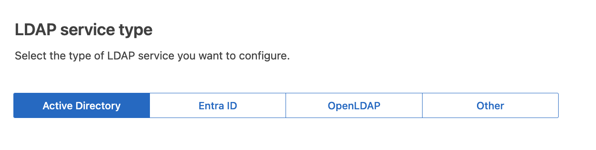

= Verificare la connessione e salvare la configurazione
:allow-uri-read: 

. Selezionare *Enable Identity Federation* (attiva federazione identità).
. Nella sezione tipo di servizio LDAP, selezionare il tipo di servizio LDAP che si desidera configurare.
+

+
Selezionare *Altro* per configurare i valori per un server LDAP che utilizza Oracle Directory Server.

. Se si seleziona *Altro*, completare i campi nella sezione attributi LDAP. In caso contrario, passare alla fase successiva.
+
** *Nome univoco utente*: il nome dell'attributo che contiene l'identificatore univoco di un utente LDAP.  Questo attributo è equivalente a `sAMAccountName` per Active Directory e `uid` per OpenLDAP.  Se stai configurando Oracle Directory Server, inserisci `uid` .
** *UUID utente*: il nome dell'attributo che contiene l'identificatore univoco permanente di un utente LDAP.  Questo attributo è equivalente a `objectGUID` per Active Directory e `entryUUID` per OpenLDAP.  Se stai configurando Oracle Directory Server, inserisci `nsuniqueid` .  Il valore di ciascun utente per l'attributo specificato deve essere un numero esadecimale di 32 cifre in formato stringa o a 16 byte, in cui i trattini vengono ignorati.
** *Nome univoco del gruppo*: il nome dell'attributo che contiene l'identificatore univoco di un gruppo LDAP.  Questo attributo è equivalente a `sAMAccountName` per Active Directory e `cn` per OpenLDAP.  Se stai configurando Oracle Directory Server, inserisci `cn` .
** *UUID gruppo*: il nome dell'attributo che contiene l'identificatore univoco permanente di un gruppo LDAP.  Questo attributo è equivalente a `objectGUID` per Active Directory e `entryUUID` per OpenLDAP.  Se stai configurando Oracle Directory Server, inserisci `nsuniqueid` .  Il valore di ciascun gruppo per l'attributo specificato deve essere un numero esadecimale di 32 cifre in formato stringa o a 16 byte, in cui i trattini vengono ignorati.

. Per tutti i tipi di servizio LDAP, inserire le informazioni richieste relative al server LDAP e alla connessione di rete nella sezione Configura server LDAP.
+
** *Nome host*: Il nome di dominio completo (FQDN) o l'indirizzo IP del server LDAP.
** *Port* (porta): Porta utilizzata per la connessione al server LDAP.
+

NOTE: La porta predefinita per STARTTLS è 389 e la porta predefinita per LDAPS è 636. Tuttavia, è possibile utilizzare qualsiasi porta purché il firewall sia configurato correttamente.

** *Username*: Percorso completo del nome distinto (DN) per l'utente che si connette al server LDAP.
+
Per Active Directory, è anche possibile specificare il nome di accesso di livello inferiore o il nome principale dell'utente.

+
L'utente specificato deve disporre dell'autorizzazione per elencare gruppi e utenti e per accedere ai seguenti attributi:

+
*** `sAMAccountName` o. `uid`
*** `objectGUID`, , `entryUUID` o `nsuniqueid`
*** `cn`
*** `memberOf` o. `isMemberOf`
*** *Active Directory*: `objectSid`, `primaryGroupID`, `userAccountControl` E `userPrincipalName`
*** *ID di ingresso*: `accountEnabled` E `userPrincipalName`

** *Password*: La password associata al nome utente.
+

NOTE: Se si modifica la password in futuro, è necessario aggiornarla in questa pagina.

** *DN base gruppo*: Il percorso completo del nome distinto (DN) per una sottostruttura LDAP che si desidera cercare gruppi. Nell'esempio di Active Directory (riportato di seguito), tutti i gruppi il cui nome distinto è relativo al DN di base (DC=storagegrid,DC=example,DC=com) possono essere utilizzati come gruppi federati.
+

NOTE: I valori *Group unique name* devono essere univoci all'interno del *Group base DN* a cui appartengono.

** *User base DN*: Percorso completo del nome distinto (DN) di una sottostruttura LDAP che si desidera cercare gli utenti.
+

NOTE: I valori *Nome univoco utente* devono essere univoci all'interno del *DN base utente* a cui appartengono.

** *Bind username format* (opzionale): Il modello di nome utente predefinito che StorageGRID deve utilizzare se il modello non può essere determinato automaticamente.
+
Si consiglia di fornire il formato *bind username* perché può consentire agli utenti di accedere se StorageGRID non è in grado di collegarsi con l'account del servizio.

+
Immettere uno di questi modelli:

+
*** *Modello UserPrincipalName (ID AD e Entra)*: `[USERNAME]@_example_.com`
*** *Modello di nome di accesso di livello inferiore (ID AD e Entra)*: `_example_\[USERNAME]`
*** *Modello di nome distinto*: `CN=[USERNAME],CN=Users,DC=_example_,DC=com`
+
Includi *[NOME UTENTE]* esattamente come scritto.

. Nella sezione Transport Layer Security (TLS), selezionare un'impostazione di protezione.
+
** *Usa STARTTLS*: usa STARTTLS per proteggere le comunicazioni con il server LDAP.  Questa è l'opzione consigliata per Active Directory, OpenLDAP o Altro, ma non è supportata per Microsoft Entra ID.
** *Usa LDAPS*: l'opzione LDAPS (LDAP su SSL) utilizza TLS per stabilire una connessione al server LDAP.  È necessario selezionare questa opzione per Microsoft Entra ID.
** *Non utilizzare TLS*: il traffico di rete tra il sistema StorageGRID e il server LDAP non sarà protetto.  Questa opzione non è supportata per Microsoft Entra ID.
+

NOTE: L'utilizzo dell'opzione *Non utilizzare TLS* non è supportato se il server Active Directory impone la firma LDAP.  È necessario utilizzare STARTTLS o LDAPS.

. Se si seleziona STARTTLS o LDAPS, scegliere il certificato utilizzato per proteggere la connessione.
+
** *Usa certificato CA del sistema operativo*: Utilizza il certificato CA Grid predefinito installato sul sistema operativo per proteggere le connessioni.
** *Usa certificato CA personalizzato*: Utilizza un certificato di protezione personalizzato.
+
Se si seleziona questa impostazione, copiare e incollare il certificato di protezione personalizzato nella casella di testo del certificato CA.

=== Verificare la connessione e salvare la configurazione

Dopo aver inserito tutti i valori, è necessario verificare la connessione prima di salvare la configurazione. StorageGRID verifica le impostazioni di connessione per il server LDAP e il formato del nome utente BIND, se fornito.

.Fasi
. Selezionare *Test di connessione*.
. Se non hai fornito un formato di nome utente di associazione:
+
** Se le impostazioni di connessione sono valide, viene visualizzato il messaggio "Test connessione riuscito". Selezionare *Salva* per salvare la configurazione.
** Se le impostazioni di connessione non sono valide, viene visualizzato il messaggio "Impossibile stabilire la connessione di prova". Selezionare *Chiudi*. Quindi, risolvere eventuali problemi e verificare nuovamente la connessione.

. Se è stato fornito un formato BIND Username, inserire il nome utente e la password di un utente federato valido.
+
Ad esempio, inserire il proprio nome utente e la propria password. Non includere caratteri speciali nel nome utente, ad esempio @ o /.

+
image::../media/identity_federation_test_connection.png[Richiesta di federazione delle identità per validare il formato del nome utente BIND]

+
** Se le impostazioni di connessione sono valide, viene visualizzato il messaggio "Test connessione riuscito". Selezionare *Salva* per salvare la configurazione.
** Viene visualizzato un messaggio di errore se le impostazioni di connessione, il formato del nome utente BIND o il nome utente e la password di prova non sono validi. Risolvere eventuali problemi e verificare nuovamente la connessione.

