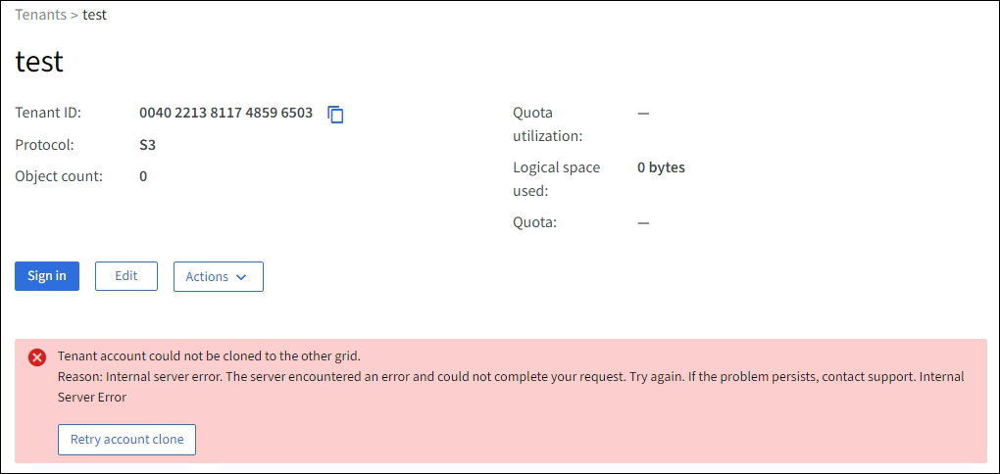
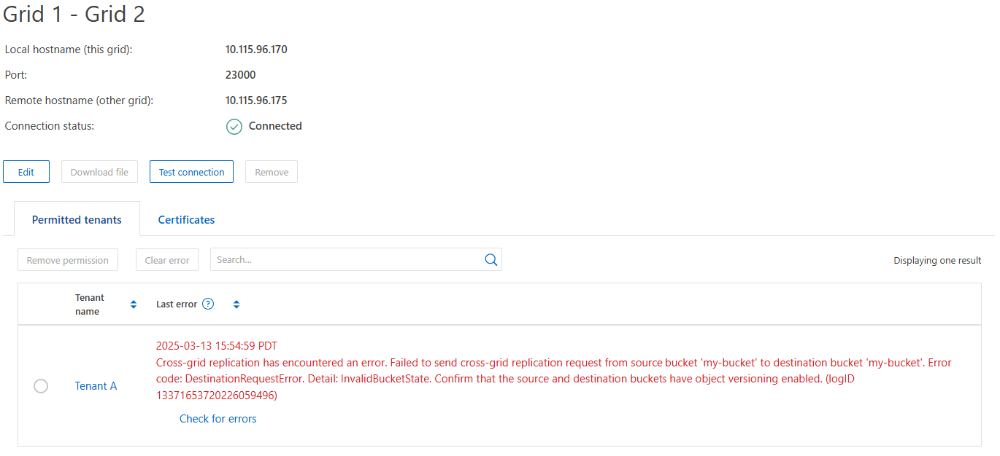

= Risolvere i problemi relativi agli errori di federazione della griglia
:allow-uri-read: 
:icons: font
:imagesdir: ../media/

[role="lead"]
Potrebbe essere necessario risolvere gli avvisi e gli errori relativi alle connessioni di federazione di griglie, al clone dell'account e alla replica cross-grid.

== [[Grid-Federation-Errors]]Avvisi ed errori di connessione a Grid Federation

È possibile che si ricevano avvisi o si verifichino errori con le connessioni della federazione di griglie.

Dopo aver apportato qualsiasi modifica per risolvere un problema di connessione, verificare che lo stato della connessione torni a *connesso*. Per istruzioni, vedere link:grid-federation-manage-connection.html["Gestire le connessioni a federazione di griglie"].

=== Avviso di errore di connessione della federazione di griglie

.Problema
È stato attivato l'avviso *errore di connessione federazione griglia*.

.Dettagli
Questo avviso indica che la connessione a federazione di griglie tra le griglie non funziona.

.Azioni consigliate
. Esaminare le impostazioni della pagina Grid Federation per entrambe le griglie. Verificare che tutti i valori siano corretti. Vedere link:grid-federation-manage-connection.html["Gestire le connessioni a federazione di griglie"].
. Esaminare i certificati utilizzati per la connessione. Assicurarsi che non ci siano avvisi per i certificati di federazione griglia scaduti e che i dettagli di ciascun certificato siano validi. Vedere le istruzioni per la rotazione dei certificati di connessione in link:grid-federation-manage-connection.html["Gestire le connessioni a federazione di griglie"].
. Verificare che tutti i nodi Admin e Gateway in entrambe le griglie siano online e disponibili. Risolvere eventuali avvisi che potrebbero interessare questi nodi e riprovare.
. Se è stato fornito un nome di dominio completo (FQDN) per la griglia locale o remota, verificare che il server DNS sia in linea e disponibile. Vedere link:grid-federation-overview.html["Che cos'è la federazione di griglie?"] per i requisiti di rete, indirizzo IP e DNS.

=== Scadenza dell'avviso del certificato di federazione griglia

.Problema
È stato attivato l'avviso *scadenza del certificato federazione griglia*.

.Dettagli
Questo avviso indica che uno o più certificati di federazione griglia stanno per scadere.

.Azioni consigliate
Vedere le istruzioni per la rotazione dei certificati di connessione in link:grid-federation-manage-connection.html["Gestire le connessioni a federazione di griglie"].

=== Errore durante la modifica di una connessione a federazione di griglie

.Problema
Quando si modifica una connessione a federazione di griglie, viene visualizzato il seguente messaggio di avviso quando si seleziona *Salva e test*: "Impossibile creare un file di configurazione candidato su uno o più nodi."

.Dettagli
Quando si modifica una connessione a federazione di griglie, StorageGRID tenta di salvare un file di "configurazione candidata" su tutti i nodi di amministrazione della prima griglia. Viene visualizzato un messaggio di avviso se il file non può essere salvato in tutti i nodi di amministrazione, ad esempio perché un nodo di amministrazione non è in linea.

.Azioni consigliate
. Dalla griglia utilizzata per modificare la connessione, selezionare *NODES* (NODI).
. Verificare che tutti i nodi Admin per la griglia siano in linea.
. Se alcuni nodi sono offline, ripristinarli online e provare a modificare nuovamente la connessione.

== Errori di cloni dell'account

=== Impossibile accedere a un account tenant clonato

.Problema
Impossibile accedere a un account tenant clonato. Il messaggio di errore nella pagina di accesso di Tenant Manager è "le credenziali per questo account non sono valide. Riprovare."

.Dettagli
Per motivi di sicurezza, quando un account tenant viene clonato dalla griglia di origine del tenant alla griglia di destinazione del tenant, la password impostata per l'utente root locale del tenant non viene clonata. Allo stesso modo, quando un tenant crea utenti locali sulla griglia di origine, le password utente locali non vengono clonate nella griglia di destinazione.

.Azioni consigliate
Prima che l'utente root possa accedere alla griglia di destinazione del tenant, è necessario che un amministratore della griglia link:changing-password-for-tenant-local-root-user.html["modificare la password per l'utente root locale"]si trovi nella griglia di destinazione.

Prima che un utente locale clonato possa accedere alla griglia di destinazione del tenant, l'utente root del tenant clonato deve aggiungere una password per l'utente nella griglia di destinazione. Per istruzioni, vedere link:../tenant/managing-local-users.html["Gestire gli utenti locali"]nelle istruzioni per l'uso di Tenant Manager.

=== Tenant creato senza un clone

.Problema
Viene visualizzato il messaggio "tenant creato senza clone" dopo aver creato un nuovo tenant con l'autorizzazione *Usa connessione federazione griglia*.

.Dettagli
Questo problema può verificarsi se gli aggiornamenti allo stato della connessione vengono posticipati, causando l'elenco di una connessione non funzionante come *connessa*.

.Azioni consigliate
. Esaminare i motivi elencati nel messaggio di errore e risolvere eventuali problemi di rete o di altro tipo che potrebbero impedire il funzionamento della connessione. Vedere <<grid-federation-errors,Avvisi ed errori di connessione Grid Federation>>.
. Seguire le istruzioni per testare una connessione di federazione della griglia in link:grid-federation-manage-connection.html["Gestire le connessioni a federazione di griglie"] per confermare che il problema è stato risolto.
. Dalla griglia di origine del tenant, selezionare *TENANT*.
. Individuare l'account tenant che non è stato clonato.
. Selezionare il nome del tenant per visualizzare la pagina dei dettagli.
. Selezionare *Retry account clone*.
+

+
Se l'errore è stato risolto, l'account tenant verrà clonato nell'altra griglia.

== Avvisi ed errori di replica cross-grid

=== Viene visualizzato l'ultimo errore per la connessione o il tenant

.Problema
Quando link:../monitor/grid-federation-monitor-connections.html["visualizzazione di una connessione a federazione di griglie"] (o quando link:grid-federation-manage-tenants.html["gestione dei tenant consentiti"] per una connessione) si nota un errore nella colonna *ultimo errore* nella pagina dei dettagli della connessione. Ad esempio:

.Dettagli
Per ogni connessione a federazione di griglie, la colonna *ultimo errore* mostra l'errore più recente che si verifica, se presente, quando i dati di un tenant venivano replicati nell'altro grid. In questa colonna viene visualizzato solo l'ultimo errore di replica cross-grid; gli errori precedenti che si sono verificati non vengono visualizzati. In questa colonna potrebbe verificarsi un errore per uno dei seguenti motivi:

* La versione dell'oggetto di origine non è stata trovata.
* Il bucket della sorgente non è stato trovato.
* Il bucket di destinazione è stato cancellato.
* Il bucket di destinazione è stato ricreato da un account diverso.
* Il bucket di destinazione ha la versione sospesa.
* Il bucket di destinazione è stato ricreato dallo stesso account, ma ora non è più disponibile.
* L'oggetto di origine dispone di impostazioni di blocco degli oggetti S3 che non sono conformi alle impostazioni di conservazione a livello di tenant della griglia di destinazione.
* L'oggetto di origine dispone di S3 impostazioni di blocco degli oggetti e S3 blocco degli oggetti è disattivato nel bucket di destinazione.

.Azioni consigliate
Se nella colonna *ultimo errore* viene visualizzato un messaggio di errore, attenersi alla seguente procedura:

. Rivedere il testo del messaggio.
. Eseguire le azioni consigliate. Ad esempio, se il controllo delle versioni è stato sospeso nel bucket di destinazione per la replica cross-grid, riabilitare il controllo delle versioni per quel bucket.
. Selezionare la connessione o l'account tenant dalla tabella.
. Selezionare *Cancella errore*.
. Selezionare *Sì* per cancellare il messaggio e aggiornare lo stato del sistema.
. Attendere 5-6 minuti, quindi inserire un nuovo oggetto nel bucket. Verificare che il messaggio di errore non venga più visualizzato.
+

NOTE: Per assicurarsi che il messaggio di errore venga cancellato, attendere almeno 5 minuti dopo l'indicazione dell'ora nel messaggio prima di acquisire un nuovo oggetto.

+

TIP: Dopo aver corretto l'errore, potrebbe essere visualizzato un nuovo *ultimo errore* se gli oggetti vengono acquisiti in un bucket diverso che presenta anche un errore.

. Per determinare se alcuni oggetti non sono stati replicati a causa dell'errore bucket, vedere link:../admin/grid-federation-retry-failed-replication.html["Identificare e riprovare le operazioni di replica non riuscite"].

=== Avviso di errore permanente della replica cross-grid

.Problema
È stato attivato l'avviso *errore permanente replica cross-grid*.

.Dettagli
Questo avviso indica che gli oggetti tenant non possono essere replicati tra i bucket su due griglie per un motivo che richiede l'intervento dell'utente per la risoluzione. Questo avviso è generalmente causato da una modifica al bucket di origine o di destinazione.

.Azioni consigliate
. Accedere alla griglia in cui è stato attivato l'avviso.
. Accedere a *CONFIGURATION* > *System* > *Grid Federation* e individuare il nome della connessione elencato nell'avviso.
. Nella scheda Permitted tenant (tenant consentiti), esaminare la colonna *Last error* (ultimo errore) per determinare quali account tenant presentano errori.
. Per ulteriori informazioni sugli errori, consultare le istruzioni nella sezione link:../monitor/grid-federation-monitor-connections.html["Monitorare le connessioni a federazione di griglie"] per esaminare le metriche di replica tra griglie.
. Per ciascun account tenant interessato:
+
.. Consultare le istruzioni nella link:../monitor/monitoring-tenant-activity.html["Monitorare l'attività del tenant"] per confermare che il tenant non ha superato la quota nella griglia di destinazione per la replica cross-grid.
.. Se necessario, aumentare la quota del tenant sulla griglia di destinazione per consentire il salvataggio di nuovi oggetti.

. Per ogni tenant interessato, accedi a tenant Manager su entrambe le griglie, in modo da poter confrontare l'elenco dei bucket.
. Per ogni bucket con replica cross-grid attivata, confermare quanto segue:
+
** Esiste un bucket corrispondente per lo stesso tenant sull'altra griglia (deve utilizzare il nome esatto).
** Entrambi i bucket hanno attivato la versione degli oggetti (la versione non può essere sospesa su nessuna griglia).
** Nessuno dei due bucket si trova nello stato *Deleting Objects: Read-only*.

. Per confermare che il problema è stato risolto, consultare le istruzioni in link:../monitor/grid-federation-monitor-connections.html["Monitorare le connessioni a federazione di griglie"] per esaminare le metriche di replica tra griglie oppure eseguire le seguenti operazioni:
+
.. Torna alla pagina Grid Federation.
.. Selezionare il tenant interessato e selezionare *Cancella errore* nella colonna *ultimo errore*.
.. Selezionare *Sì* per cancellare il messaggio e aggiornare lo stato del sistema.
.. Attendere 5-6 minuti, quindi inserire un nuovo oggetto nel bucket. Verificare che il messaggio di errore non venga più visualizzato.
+

NOTE: Per assicurarsi che il messaggio di errore venga cancellato, attendere almeno 5 minuti dopo l'indicazione dell'ora nel messaggio prima di acquisire un nuovo oggetto.

+

NOTE: Una volta risolto, l'avviso potrebbe richiedere fino a un giorno.

.. Accedere a link:grid-federation-retry-failed-replication.html["Identificare e riprovare le operazioni di replica non riuscite"] per identificare gli oggetti o eliminare i marcatori che non sono stati replicati nell'altra griglia e riprovare la replica secondo necessità.

=== Avviso di risorsa di replica cross-grid non disponibile

.Problema
È stato attivato l'avviso *risorsa di replica cross-grid non disponibile*.

.Dettagli
Questo avviso indica che le richieste di replica cross-grid sono in sospeso perché una risorsa non è disponibile. Ad esempio, potrebbe essere presente un errore di rete.

.Azioni consigliate
. Monitorare l'avviso per verificare se il problema si risolve da solo.
. Se il problema persiste, determinare se una griglia presenta un avviso di errore di connessione * federazione griglia per la stessa connessione o un avviso di errore di comunicazione * con nodo * per un nodo. Questo avviso potrebbe essere risolto quando si risolvono tali avvisi.
. Per ulteriori informazioni sugli errori, consultare le istruzioni nella sezione link:../monitor/grid-federation-monitor-connections.html["Monitorare le connessioni a federazione di griglie"] per esaminare le metriche di replica tra griglie.
. Se non riesci a risolvere l'avviso, contatta il supporto tecnico.

La replica cross-grid procederà normalmente dopo la risoluzione del problema.
