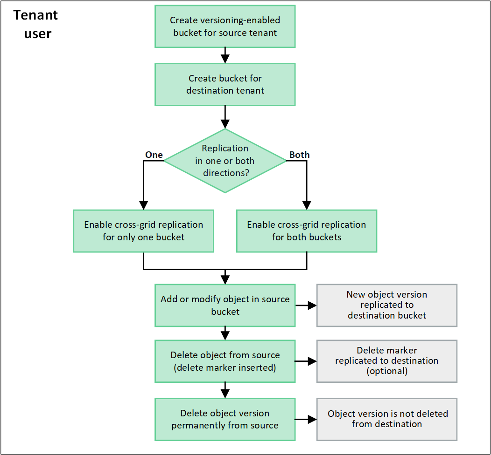

= Che cos'è la replica cross-grid?
:allow-uri-read: 
:icons: font
:imagesdir: ../media/

[role="lead"]
La replica cross-grid è la replica automatica di oggetti tra bucket S3 selezionati in due sistemi StorageGRID connessi in un link:grid-federation-overview.html["connessione a federazione di griglie"]. link:grid-federation-what-is-account-clone.html["Clone dell'account"] sia necessaria per la replica cross-grid.

== Workflow per la replica cross-grid

Il diagramma del flusso di lavoro riassume i passaggi per configurare la replica tra griglie tra bucket su due griglie.

== Requisiti per la replica cross-grid

Se un account tenant ha l'autorizzazione *Usa connessione federazione griglia* per utilizzare una o piùlink:grid-federation-overview.html["connessioni a federazione di griglie"] , un utente tenant con autorizzazione di accesso Root può creare bucket negli account tenant corrispondenti su ciascuna griglia.  Questi secchi:

* Possono avere nomi diversi l'uno dall'altro
* Può avere regioni diverse
* È necessario attivare la versione
* Deve essere vuoto

Una volta creati entrambi i bucket, è possibile configurare la replica cross-grid per uno o entrambi i bucket.

.Scopri di più
link:../tenant/grid-federation-manage-cross-grid-replication.html["Gestire la replica cross-grid"]

== Come funziona la replica cross-grid

È possibile configurare la replica tra griglie in modo che avvenga in una direzione o in entrambe le direzioni.

=== Replica in un'unica direzione

Se si abilita la replica tra griglie per un bucket su una sola griglia, gli oggetti aggiunti a quel bucket (il bucket di origine) vengono replicati nel bucket corrispondente sull'altra griglia (il bucket di destinazione).  Tuttavia, gli oggetti aggiunti al bucket di destinazione non vengono replicati nell'origine.  Nella figura, la replicazione cross-grid è abilitata per `my-bucket` dalla Griglia 1 alla Griglia 2, ma non è abilitato nella direzione opposta.

image::../media/grid-federation-cross-grid-replication-one-direction.png[immagine che mostra la connessione a federazione di griglie in una direzione]

=== Replica in entrambe le direzioni

Se si attiva la replica cross-grid per lo stesso bucket su entrambe le griglie, gli oggetti aggiunti a entrambi i bucket vengono replicati nell'altra griglia. Nella figura, la replica cross-grid è abilitata per `my-bucket` in entrambe le direzioni.

image::../media/grid-federation-cross-grid-replication.png[immagine che mostra la replica in una direzione rispetto alla replica in entrambe le direzioni]

=== Cosa succede quando gli oggetti vengono acquisiti?

Quando un client S3 aggiunge un oggetto a un bucket con replica cross-grid attivata, si verifica quanto segue:

. StorageGRID replica automaticamente l'oggetto dal bucket di origine al bucket di destinazione. Il tempo necessario per eseguire questa operazione di replica in background dipende da diversi fattori, tra cui il numero di altre operazioni di replica in sospeso.
+
Il client S3 può verificare lo stato di replicazione di un oggetto inviando una richiesta GetObject o HeadObject.  La risposta include uno StorageGRID specifico `x-ntap-sg-cgr-replication-status` intestazione di risposta, che ha uno dei seguenti valori:

+
[cols="1a,2a"]
|===
| Griglia | Stato della replica 

 a| 
Origine
 a| 
** *COMPLETATO*: La replica è stata eseguita correttamente per tutte le connessioni di rete.
** *PENDING*: L'oggetto non è stato replicato in almeno una connessione di rete.
** *ERRORE*: La replica non è in sospeso per nessuna connessione alla rete e almeno una è fallita con un errore permanente.  Un utente deve risolvere l'errore.

 a| 
Destinazione
 a| 
*REPLICA*: L'oggetto è stato replicato dalla griglia di origine.

|===
+

NOTE: StorageGRID non supporta il `x-amz-replication-status` intestazione.

. StorageGRID utilizza i criteri ILM attivi di ciascuna griglia per gestire gli oggetti, esattamente come per qualsiasi altro oggetto. Ad esempio, l'oggetto A sulla griglia 1 potrebbe essere memorizzato come due copie replicate e conservato per sempre, mentre la copia dell'oggetto A replicata sulla griglia 2 potrebbe essere memorizzata utilizzando la codifica di cancellazione 2+1 ed eliminata dopo tre anni.

=== Cosa succede quando gli oggetti vengono cancellati?

Come descritto in link:../primer/delete-data-flow.html["Eliminare il flusso di dati"], StorageGRID può eliminare un oggetto per uno dei seguenti motivi:

* Il client S3 invia una richiesta di eliminazione.
* Un utente di Tenant Manager seleziona l'link:../tenant/deleting-s3-bucket-objects.html["Eliminare gli oggetti nel bucket"]opzione per rimuovere tutti gli oggetti da un bucket.
* Il bucket ha una configurazione del ciclo di vita che scade.
* L'ultimo periodo di tempo nella regola ILM per l'oggetto termina e non sono stati specificati ulteriori posizionamenti.

Quando StorageGRID elimina un oggetto a causa di un'operazione Delete Objects (Elimina oggetti) nel bucket, della scadenza del ciclo di vita del bucket o della scadenza del posizionamento ILM, l'oggetto replicato non viene mai cancellato dall'altra griglia in una connessione a federazione di griglie. Tuttavia, i marker di eliminazione aggiunti al bucket di origine da S3 client Delete possono essere replicati nel bucket di destinazione.

Per capire cosa accade quando un client S3 elimina oggetti da un bucket che ha la replica cross-grid attivata, rivedere come i client S3 eliminano oggetti dai bucket che hanno la versione attivata, come segue:

* Se un client S3 invia una richiesta di eliminazione che include un ID di versione, la versione dell'oggetto viene rimossa in modo permanente. Nessun marker di eliminazione aggiunto al bucket.
* Se un client S3 invia una richiesta di eliminazione che non include un ID versione, StorageGRID non elimina alcuna versione dell'oggetto.  Invece, aggiunge un marcatore di eliminazione al bucket.  Il marcatore di eliminazione fa sì che StorageGRID agisca come se l'oggetto fosse stato eliminato:
+
** Una richiesta GetObject senza un ID versione fallisce con `404 No Object Found`
** Una richiesta GetObject con un ID versione valido ha esito positivo e restituisce la versione dell'oggetto richiesta.

Quando un client S3 elimina un oggetto da un bucket con la replica cross-grid attivata, StorageGRID determina se replicare la richiesta di eliminazione nella destinazione, come segue:

* Se la richiesta di eliminazione include un ID versione, la versione dell'oggetto viene rimossa definitivamente dalla griglia di origine.  Tuttavia, StorageGRID non replica le richieste di eliminazione che includono un ID versione, quindi la stessa versione dell'oggetto non viene eliminata dalla destinazione.
* Se la richiesta di eliminazione non include un ID versione, StorageGRID può facoltativamente replicare il marcatore di eliminazione, in base alla configurazione della replica tra griglie per il bucket:
+
** Se si sceglie di replicare i marker di eliminazione (impostazione predefinita), un marker di eliminazione viene aggiunto al bucket di origine e replicato nel bucket di destinazione. In effetti, l'oggetto sembra essere cancellato su entrambe le griglie.
** Se si sceglie di non replicare i marcatori di eliminazione, un marcatore di eliminazione viene aggiunto al bucket di origine ma non viene replicato nel bucket di destinazione.  In effetti, gli oggetti eliminati nella griglia di origine non vengono eliminati nella griglia di destinazione.

Nella figura, *Replica elimina marcatori* è stato impostato su *Sì* quandolink:../tenant/grid-federation-manage-cross-grid-replication.html["la replica cross-grid è stata attivata"] .  Le richieste di eliminazione per il bucket di origine che includono un ID versione non eliminano gli oggetti dal bucket di destinazione.  Le richieste di eliminazione per il bucket di origine che non includono un ID versione sembrano eliminare gli oggetti nel bucket di destinazione.

image::../media/grid-federation-cross-grid-replication-delete.png[immagine che mostra l'eliminazione del client replicato su entrambe le griglie]

NOTE: Se si desidera mantenere sincronizzate le eliminazioni degli oggetti tra le griglie, creare corrispondenti link:../s3/create-s3-lifecycle-configuration.html["Configurazioni del ciclo di vita S3"] per i bucket su entrambe le griglie.

=== Modalità di replica degli oggetti crittografati

Quando si utilizza la replica cross-grid per replicare oggetti tra griglie, è possibile crittografare singoli oggetti, utilizzare la crittografia bucket predefinita o configurare la crittografia a livello di griglia. È possibile aggiungere, modificare o rimuovere le impostazioni di crittografia predefinite del bucket o dell'intera griglia prima o dopo aver attivato la replica cross-grid per un bucket.

Per crittografare singoli oggetti, è possibile utilizzare SSE (crittografia lato server con chiavi gestite da StorageGRID) quando si aggiungono gli oggetti al bucket di origine. Utilizzare l' `x-amz-server-side-encryption`intestazione della richiesta e specificare `AES256`. Vedere link:../s3/using-server-side-encryption.html["Utilizzare la crittografia lato server"].

NOTE: L'utilizzo di SSE-C (crittografia lato server con chiavi fornite dal cliente) non è supportato per la replica tra griglie.  L'operazione di acquisizione non andrà a buon fine.

Per utilizzare la crittografia predefinita per un bucket, utilizzare una richiesta PutBucketEncryption e impostare il `SSEAlgorithm` parametro su `AES256`. La crittografia a livello di bucket si applica a tutti gli oggetti acquisiti senza l' `x-amz-server-side-encryption`intestazione della richiesta. Vedere link:../s3/operations-on-buckets.html["Operazioni sui bucket"].

Per utilizzare la crittografia a livello di griglia, impostare l'opzione *Stored Object Encryption* su *AES-256*. La crittografia a livello di griglia si applica a tutti gli oggetti che non sono crittografati a livello di bucket o che sono acquisiti senza l' `x-amz-server-side-encryption`intestazione della richiesta. Vedere link:../admin/changing-network-options-object-encryption.html["Configurare le opzioni di rete e degli oggetti"].

NOTE: SSE non supporta AES-128.  Se l'opzione *Crittografia degli oggetti archiviati* è abilitata per la griglia di origine utilizzando l'opzione *AES-128*, l'uso dell'algoritmo AES-128 non viene propagato all'oggetto replicato.  Al contrario, l'oggetto replicato utilizza il bucket predefinito della destinazione o l'impostazione di crittografia a livello di griglia, se disponibile.

Quando si determina come crittografare gli oggetti di origine, StorageGRID applica le seguenti regole:

. Utilizzare l' `x-amz-server-side-encryption`intestazione di acquisizione, se presente.
. Se non è presente un'intestazione di acquisizione, utilizzare l'impostazione di crittografia predefinita del bucket, se configurata.
. Se non è configurata un'impostazione bucket, utilizzare l'impostazione di crittografia a livello di griglia, se configurata.
. Se non è presente un'impostazione a livello di griglia, non crittografare l'oggetto sorgente.

Quando si determina come crittografare gli oggetti replicati, StorageGRID applica queste regole nel seguente ordine:

. Utilizzare la stessa crittografia dell'oggetto di origine, a meno che tale oggetto non utilizzi la crittografia AES-128.
. Se l'oggetto di origine non è crittografato o utilizza AES-128, utilizzare l'impostazione di crittografia predefinita del bucket di destinazione, se configurata.
. Se il bucket di destinazione non dispone di un'impostazione di crittografia, utilizzare l'impostazione di crittografia a livello di griglia della destinazione, se configurata.
. Se non è presente un'impostazione a livello di griglia, non crittografare l'oggetto di destinazione.

=== Replicazione cross-grid con S3 Object Lock

È possibile configurare la replica tra reti diverse tra bucket StorageGRID con S3 Object Lock abilitato nelle seguenti circostanze.

[cols="1a,1a"]
|===
| Quando S3 Object Lock sul bucket di origine è... | E S3 Object Lock sul bucket di destinazione è... 

 a| 
Abilitato
 a| 
Abilitato

 a| 
Disabili
 a| 
Abilitato

|===
Quando S3 Object Lock sul bucket di origine è abilitato:

* Gli oggetti vengono bloccati con le impostazioni di conservazione nella destinazione in questo ordine:
+
.. Valori dell'intestazione di conservazione dell'oggetto sorgente per:
+
`x-amz-object-lock-mode`

+
`x-amz-object-lock-retain-until-date`

.. Se impostata, la conservazione predefinita del bucket di origine.
.. Se impostata, la conservazione predefinita del bucket di destinazione.

+
La conservazione predefinita del bucket di destinazione non sostituisce le impostazioni di conservazione replicate dall'oggetto di origine.

* È possibile impostare lo stato di conservazione legale per l'oggetto di destinazione utilizzando `x-amz-object-lock-legal-hold` durante il caricamento dell'oggetto.
* Si verifica un errore se il tenant o il bucket di destinazione non supporta le impostazioni di blocco degli oggetti S3 dell'oggetto di origine. Fare riferimento a link:../admin/grid-federation-troubleshoot.html#cross-grid-replication-alerts-and-errors["Avvisi ed errori di replicazione tra griglie."]

Quando S3 Object Lock sul bucket di origine è disabilitato:

* È possibile configurare la conservazione predefinita sul bucket di destinazione per applicare le impostazioni di conservazione S3 Object Lock all'oggetto di destinazione.
* L'oggetto di destinazione non può impostare uno stato di conservazione legale.

=== PutObjectTagging e DeleteObjectTagging non sono supportati

Le richieste PutObjectTagging e DeleteObjectTagging non sono supportate per gli oggetti nei bucket in cui è abilitata la replica cross-grid.

Se un client S3 emette una richiesta PutObjectTagging o DeleteObjectTagging, `501 Not Implemented` viene restituito.  Il messaggio è `Put(Delete) ObjectTagging isn't available for buckets that have cross-grid replication configured` .

=== PutObjectRetention e PutObjectLegalHold non sono supportati

Le richieste PutObjectRetention e PutObjectLegalHold non sono completamente supportate per gli oggetti nei bucket in cui è abilitata la replica tra griglie.

Se un client S3 invia una richiesta PutObjectRetention o PutObjectLegalHold, le impostazioni dell'oggetto di origine vengono modificate, ma le modifiche non vengono applicate alla destinazione.

=== Come vengono replicati gli oggetti segmentati

La dimensione massima del segmento della griglia di origine si applica agli oggetti replicati nella griglia di destinazione.  Quando gli oggetti vengono replicati su un'altra griglia, l'impostazione *Dimensione massima del segmento* (*Configurazione* > *Sistema* > *Opzioni di archiviazione*) della griglia di origine viene utilizzata su entrambe le griglie.  Ad esempio, supponiamo che la dimensione massima del segmento per la griglia di origine sia 1 GB, mentre la dimensione massima del segmento per la griglia di destinazione sia 50 MB.  Se si acquisisce un oggetto da 2 GB nella griglia di origine, tale oggetto viene salvato come due segmenti da 1 GB.  Viene inoltre replicato nella griglia di destinazione come due segmenti da 1 GB, anche se la dimensione massima del segmento di quella griglia è di 50 MB.
