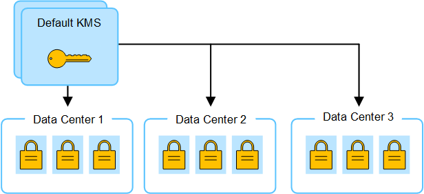

= Considerazioni per la modifica del KMS per un sito
:allow-uri-read: 
:icons: font
:imagesdir: ../media/

[role="lead"]
Ciascun server di gestione delle chiavi (KMS) o cluster KMS fornisce una chiave di crittografia a tutti i nodi appliance di un singolo sito o di un gruppo di siti. Se è necessario modificare il KMS utilizzato per un sito, potrebbe essere necessario copiare la chiave di crittografia da un KMS all'altro.

Se si modifica il KMS utilizzato per un sito, è necessario assicurarsi che i nodi appliance precedentemente crittografati in quel sito possano essere decifrati utilizzando la chiave memorizzata nel nuovo KMS. In alcuni casi, potrebbe essere necessario copiare la versione corrente della chiave di crittografia dal KMS originale al nuovo KMS. È necessario assicurarsi che il KMS disponga della chiave corretta per decrittare i nodi crittografati dell'appliance nel sito.

Ad esempio:

. Inizialmente, viene configurato un KMS predefinito che si applica a tutti i siti che non dispongono di un KMS dedicato.
. Una volta salvato il KMS, tutti i nodi appliance con l'impostazione *Node Encryption* attivata si connettono al KMS e richiedono la chiave di crittografia. Questa chiave viene utilizzata per crittografare i nodi dell'appliance in tutti i siti. La stessa chiave deve essere utilizzata anche per decrittare tali appliance.
+

. Si decide di aggiungere un KMS specifico del sito per un sito (data center 3 nella figura). Tuttavia, poiché i nodi dell'appliance sono già crittografati, si verifica un errore di convalida quando si tenta di salvare la configurazione per il KMS specifico del sito. L'errore si verifica perché il KMS specifico del sito non dispone della chiave corretta per decrittare i nodi in quel sito.
+
image::../media/kms_wrong_key.png[KMS - chiave errata]

. Per risolvere il problema, copiare la versione corrente della chiave di crittografia dal KMS predefinito al nuovo KMS. Tecnicamente, si copia la chiave originale in una nuova chiave con lo stesso alias. La chiave originale diventa una versione precedente della nuova chiave). Il KMS specifico del sito dispone ora della chiave corretta per decrittografare i nodi appliance nel data center 3, in modo che possa essere salvato in StorageGRID.
+
image::../media/kms_copied_key.png[Chiave copiata KMS]

== Casi di utilizzo per la modifica del KMS utilizzato per un sito

La tabella riassume i passaggi necessari per i casi più comuni di modifica del KMS per un sito.

[cols="1a,2a"]
|===
| Caso d'utilizzo per la modifica del KMS di un sito | Passaggi richiesti 

 a| 
Si dispone di una o più voci KMS specifiche del sito e si desidera utilizzarne una come KMS predefinito.
 a| 
Modificare il KMS specifico del sito. Nel campo *Gestisci chiavi per*, selezionare *Siti non gestiti da un altro KMS (KMS predefinito)*. Il KMS specifico del sito verrà ora utilizzato come KMS predefinito. Si applica a tutti i siti che non dispongono di un KMS dedicato.

link:kms-editing.html["Modifica di un server di gestione delle chiavi (KMS)"]

 a| 
Si dispone di un KMS predefinito e si aggiunge un nuovo sito in un'espansione. Non si desidera utilizzare il KMS predefinito per il nuovo sito.
 a| 
. Se i nodi dell'appliance nel nuovo sito sono già stati crittografati con il KMS predefinito, utilizzare il software KMS per copiare la versione corrente della chiave di crittografia dal KMS predefinito a un nuovo KMS.
. Utilizzando Grid Manager, aggiungere il nuovo KMS e selezionare il sito.

link:kms-adding.html["Aggiunta di un server di gestione delle chiavi (KMS)"]

 a| 
Si desidera che il KMS di un sito utilizzi un server diverso.
 a| 
. Se i nodi dell'appliance nel sito sono già stati crittografati dal KMS esistente, utilizzare il software KMS per copiare la versione corrente della chiave di crittografia dal KMS esistente al nuovo KMS.
. Utilizzando Grid Manager, modificare la configurazione KMS esistente e inserire il nuovo nome host o indirizzo IP.

link:kms-adding.html["Aggiunta di un server di gestione delle chiavi (KMS)"]

|===