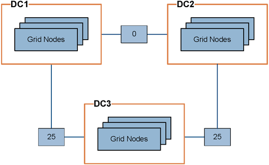

= Gestire i costi di collegamento
:allow-uri-read: 
:icons: font
:imagesdir: ../media/

[role="lead"]
I costi di collegamento consentono di assegnare la priorità al sito del data center che fornisce un servizio richiesto quando esistono due o più siti del data center. È possibile regolare i costi di collegamento in modo da riflettere la latenza tra i siti.

== Quali sono i costi di collegamento?

* I costi di collegamento vengono utilizzati per assegnare la priorità alla copia oggetto utilizzata per soddisfare i recuperi di oggetti.
* I costi di collegamento vengono utilizzati dall'API di gestione del grid e dall'API di gestione del tenant per determinare i servizi StorageGRID interni da utilizzare.
* I costi di collegamento vengono utilizzati dal servizio Load Balancer sui nodi Admin e sui nodi Gateway per indirizzare le connessioni client. Vedere link:../admin/managing-load-balancing.html["Considerazioni per il bilanciamento del carico"].

Il diagramma mostra una griglia a tre siti con costi di collegamento configurati tra i siti:

* Il servizio Load Balancer sui nodi Admin e Gateway distribuisce in modo uguale le connessioni client a tutti i nodi Storage nello stesso sito del data center e a qualsiasi sito del data center con un costo di collegamento pari a 0.
+
Nell'esempio, un nodo gateway nel sito 1 del data center (DC1) distribuisce in modo uguale le connessioni client ai nodi di storage in DC1 e ai nodi di storage in DC2. Un nodo gateway in DC3 invia le connessioni client solo ai nodi di storage in DC3.

* Quando si recupera un oggetto che esiste come copie replicate multiple, StorageGRID recupera la copia nel data center che ha il costo di collegamento più basso.
+
Nell'esempio, se un'applicazione client in DC2 recupera un oggetto memorizzato sia in DC1 che in DC3, l'oggetto viene recuperato da DC1, poiché il costo di collegamento da DC1 a DC2 è 0, che è inferiore al costo di collegamento da DC3 a DC2 (25).

I costi di collegamento sono numeri relativi arbitrari senza unità di misura specifica. Ad esempio, un costo di collegamento di 50 viene utilizzato in modo meno preferenziale rispetto a un costo di collegamento di 25. La tabella mostra i costi di collegamento comunemente utilizzati.

[cols="1a,1a,2a"]
|===
| Collegamento | Costo del collegamento | Note 

 a| 
Tra siti fisici di data center
 a| 
25 (impostazione predefinita)
 a| 
Data center connessi tramite un collegamento WAN.

 a| 
Tra i siti del data center logico nella stessa posizione fisica
 a| 
0
 a| 
Data center logici nello stesso edificio fisico o campus connessi da una LAN.

|===

== Aggiornare i costi dei collegamenti

È possibile aggiornare i costi di collegamento tra i siti del data center per riflettere la latenza tra i siti.

.Prima di iniziare
* L'utente ha effettuato l'accesso a Grid Manager utilizzando un link:../admin/web-browser-requirements.html["browser web supportato"].
* Tu hai illink:admin-group-permissions.html["Altre autorizzazioni di configurazione della griglia"] .

.Fasi
. Seleziona *Supporto* > *Altro* > *Costo del collegamento*.
+
image::../media/configuring_link_costs.png[Costo del collegamento]

. Selezionare un sito in *link Source* (origine collegamento) e immettere un valore di costo compreso tra 0 e 100 in *link Destination* (destinazione collegamento).
+
Non puoi modificare il costo del collegamento se l'origine è la stessa della destinazione.

+
Per annullare le modifiche, selezionare image:../media/nms_revert.gif["icona di annullamento"]*Ripristina*.

. Selezionare *Applica modifiche*.

