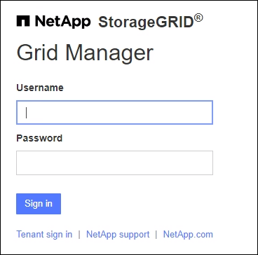

= Accedi a Grid Manager
:allow-uri-read: 
:icons: font
:imagesdir: ../media/

[role="lead"]
Per accedere alla pagina di accesso di Grid Manager, immettere il nome di dominio completo (FQDN) o l'indirizzo IP di un nodo amministratore nella barra degli indirizzi di un browser Web supportato.

Ogni sistema StorageGRID include un nodo di amministrazione primario e un numero qualsiasi di nodi di amministrazione non primari. Per gestire il sistema StorageGRID, è possibile accedere a Grid Manager da qualsiasi nodo amministrativo. Tuttavia, alcune procedure di manutenzione possono essere eseguite solo dal nodo amministrativo primario.

=== Connettersi al gruppo ha

Se i nodi di amministrazione sono inclusi in un gruppo ad alta disponibilità (ha), la connessione viene eseguita utilizzando l'indirizzo IP virtuale del gruppo ha o un nome di dominio completo che viene mappato all'indirizzo IP virtuale. Il nodo di amministrazione primario deve essere selezionato come interfaccia principale del gruppo, in modo che quando si accede a Grid Manager, si accede al nodo di amministrazione primario, a meno che il nodo di amministrazione primario non sia disponibile. Vedere link:managing-high-availability-groups.html["Gestire i gruppi ad alta disponibilità"].

=== Utilizzare SSO

I passaggi di accesso sono leggermente diversi se link:configuring-sso.html["È stato configurato Single Sign-on (SSO)"].

== Accedi a Grid Manager sul primo nodo di amministrazione

.Prima di iniziare
* Si dispone delle credenziali di accesso.
* Si sta utilizzando un link:../admin/web-browser-requirements.html["browser web supportato"].
* I cookie sono attivati nel browser Web.
* L'utente appartiene a un gruppo di utenti che dispone di almeno un'autorizzazione.
* Hai l'URL per Grid Manager:
+
`https://_FQDN_or_Admin_Node_IP_/`

+
È possibile utilizzare il nome di dominio completo, l'indirizzo IP di un nodo amministratore o l'indirizzo IP virtuale di un gruppo ha di nodi amministratore.

+
Per accedere a Grid Manager su una porta diversa da quella predefinita per HTTPS (443), includere il numero di porta nell'URL:

+
`https://_FQDN_or_Admin_Node_IP:port_/`

+

NOTE: SSO non è disponibile sulla porta di Restricted Grid Manager. È necessario utilizzare la porta 443.

.Fasi
. Avviare un browser Web supportato.
. Nella barra degli indirizzi del browser, immettere l'URL per Grid Manager.
. Se viene richiesto un avviso di protezione, installare il certificato utilizzando l'installazione guidata del browser. Vedere link:using-storagegrid-security-certificates.html["Gestire i certificati di sicurezza"].
. Accedi a Grid Manager.
+
La schermata di accesso visualizzata dipende dalla configurazione di SSO (Single Sign-on) per StorageGRID.

+
[role="tabbed-block"]
====
.Non si utilizza SSO
--
.. Immettere il nome utente e la password per Grid Manager.
.. Selezionare *Accedi*.
+

--
.Utilizzo di SSO
--
** Se StorageGRID utilizza SSO ed è la prima volta che si accede all'URL dal browser:
+
... Selezionare *Accedi*. È possibile lasciare lo 0 nel campo account.
+
image::../media/sso_sign_in_first_time.png[Schermata di accesso se SSO è attivato e non sono presenti cookie]

... Immettere le credenziali SSO standard nella pagina di accesso SSO dell'organizzazione. Ad esempio:
+
image::../media/sso_organization_page.gif[Esempio di pagina di accesso all'organizzazione per SSO]

** Se StorageGRID utilizza SSO e si è precedentemente effettuato l'accesso a Grid Manager o a un account tenant:
+
... Inserire *0* (l'ID account per Grid Manager) o selezionare *Grid Manager* se compare nell'elenco degli account recenti.
+
image::../media/sign_in_grid_manager_sso.png[Selezionare Grid Manager dall'elenco degli account recenti se SSO è attivato]

... Selezionare *Accedi*.
... Accedi con le tue credenziali SSO standard nella pagina di accesso SSO della tua organizzazione.

--
====

Una volta effettuato l'accesso, viene visualizzata la home page di Grid Manager, che include la dashboard. Per informazioni sulle informazioni fornite, vedere link:../monitor/viewing-dashboard.html["Visualizzare e gestire la dashboard"].

image::../media/grid_manager_dashboard.png[dashboard]

== Accedere a un altro nodo amministratore

Per accedere a un altro nodo amministratore, procedere come segue.

[role="tabbed-block"]
====
.Non si utilizza SSO
--
.Fasi
. Nella barra degli indirizzi del browser, inserire il nome di dominio completo o l'indirizzo IP dell'altro nodo di amministrazione. Includere il numero di porta come richiesto.
. Immettere il nome utente e la password per Grid Manager.
. Selezionare *Accedi*.

--
.Utilizzo di SSO
--
Se StorageGRID utilizza SSO ed è stato effettuato l'accesso a un nodo amministratore, è possibile accedere ad altri nodi amministrativi senza dover effettuare nuovamente l'accesso.

.Fasi
. Inserire il nome di dominio completo o l'indirizzo IP dell'altro nodo di amministrazione nella barra degli indirizzi del browser.
. Se la sessione SSO è scaduta, immettere nuovamente le credenziali.

--
====