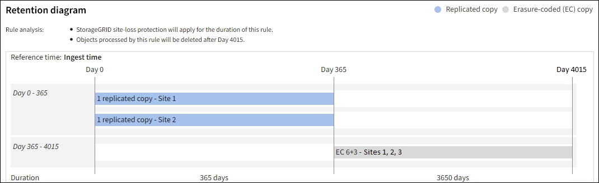

= Fase 2 di 3: Definizione delle posizioni
:allow-uri-read: 
:icons: font
:imagesdir: ../media/

[role="lead"]
La fase *Definisci posizionamenti* della procedura guidata Crea regola ILM consente di definire le istruzioni di posizionamento che determinano la durata dell'archiviazione degli oggetti, il tipo di copie (replicate o sottoposte a erasure coding), la posizione di archiviazione e il numero di copie.

NOTE: Le schermate mostrate sono esempi. I risultati possono variare a seconda della versione di StorageGRID in uso.

.A proposito di questa attività
Una regola ILM può includere una o più istruzioni di posizionamento. Ogni istruzione di posizionamento si applica a un singolo periodo di tempo. Quando si utilizzano più istruzioni, i periodi di tempo devono essere contigui e almeno un'istruzione deve iniziare il giorno 0. Le istruzioni possono continuare per sempre o fino a quando non sono più necessarie copie di oggetti.

Ogni istruzione di posizionamento può avere più righe se si desidera creare diversi tipi di copie o utilizzare posizioni diverse durante tale periodo di tempo.

In questo esempio, la regola ILM memorizza una copia replicata nel sito 1 e una copia replicata nel sito 2 per il primo anno. Dopo un anno, viene creata una copia 2+1 con codice di cancellazione e salvata in un solo sito.

image::../media/ilm_create_ilm_rule_wizard_2.png[Creazione guidata regole ILM fase 2]

.Fasi
. Per *Reference Time* (tempo di riferimento), selezionare il tipo di tempo da utilizzare per il calcolo dell'ora di inizio di un'istruzione di posizionamento.
+
[cols="1a,2a"]
|===
| Opzione | Descrizione 

 a| 
Tempo di acquisizione
 a| 
L'ora in cui l'oggetto è stato acquisito.

 a| 
Ora dell'ultimo accesso
 a| 
L'ora in cui l'oggetto è stato recuperato per l'ultima volta (letto o visualizzato).

Per utilizzare questa opzione, è necessario attivare gli aggiornamenti dell'ora dell'ultimo accesso per il bucket S3. Fare riferimento alla link:using-last-access-time-in-ilm-rules.html["USA l'ultimo tempo di accesso nelle regole ILM"].

 a| 
Tempo di creazione definito dall'utente
 a| 
Tempo specificato nei metadati definiti dall'utente.

 a| 
Ora non corrente
 a| 
L'opzione "ora non corrente" viene selezionata automaticamente se si seleziona *Sì* per la domanda "Applica questa regola solo alle versioni precedenti degli oggetti (nei bucket S3 con versione abilitata)?" in link:create-ilm-rule-enter-details.html["Passaggio 1 della creazione guidata di una regola ILM"].

|===
+
Se si desidera creare una regola _conforme_, è necessario selezionare *ora di acquisizione*. Fare riferimento alla link:managing-objects-with-s3-object-lock.html["Gestire gli oggetti con S3 Object Lock"].

. Nella sezione *periodo di tempo e posizionamenti*, inserire un'ora di inizio e una durata per il primo periodo di tempo.
+
Ad esempio, è possibile specificare dove memorizzare gli oggetti per il primo anno (_dal giorno 0 memorizzare per 365 giorni_). Almeno un'istruzione deve iniziare al giorno 0.

. Se si desidera creare copie replicate:
+
.. Dall'elenco a discesa *Memorizza oggetti per*, selezionare *replica*.
.. Selezionare il numero di copie che si desidera eseguire.
+
Se si modifica il numero di copie in 1, viene visualizzato un avviso. Una regola ILM che crea una sola copia replicata per qualsiasi periodo di tempo mette i dati a rischio di perdita permanente. Fare riferimento alla link:why-you-should-not-use-single-copy-replication.html["Perché non utilizzare la replica a copia singola"].

+
Per evitare il rischio, effettuare una o più delle seguenti operazioni:

+
*** Aumentare il numero di copie per il periodo di tempo.
*** Aggiungere copie ad altri pool di storage o a un pool di storage cloud.
*** Selezionare *erasure coding* invece di *Replicing*.
+
È possibile ignorare questo avviso se questa regola crea già più copie per tutti i periodi di tempo.

.. Nel campo *Copies at*, selezionare i pool di storage che si desidera aggiungere.
+
*Se si specifica un solo pool di storage*, tenere presente che StorageGRID può memorizzare solo una copia replicata di un oggetto su un nodo di storage specifico. Se la griglia include tre nodi di storage e si seleziona 4 come numero di copie, verranno eseguite solo tre copie e 8212 una copia per ciascun nodo di storage.

+
Viene attivato l'avviso *ILM placement unachievable* per indicare che la regola ILM non può essere applicata completamente.

+
*Se si specificano più pool di storage*, tenere presenti le seguenti regole:

+
*** Il numero di copie non può essere superiore al numero di pool di storage.
*** Se il numero di copie corrisponde al numero di pool di storage, viene memorizzata una copia dell'oggetto in ciascun pool di storage.
*** Se il numero di copie è inferiore al numero di pool di storage, una copia viene memorizzata nel sito di acquisizione e il sistema distribuisce le copie rimanenti per mantenere bilanciato l'utilizzo del disco tra i pool, garantendo che nessun sito riceva più di una copia di un oggetto.
*** Se i pool di storage si sovrappongono (contengono gli stessi nodi di storage), tutte le copie dell'oggetto potrebbero essere salvate in un solo sito. Per questo motivo, non specificare il pool di storage di tutti i nodi di storage (StorageGRID 11.6 e versioni precedenti) e un altro pool di storage.

. Se si desidera creare una copia con codice di cancellazione:
+
.. Dall'elenco a discesa *Memorizza oggetti per*, selezionare *erasure coding*.
+

NOTE: L'erasure coding è più adatto per oggetti superiori a 1 MB. Non utilizzare la codifica erasure per oggetti di dimensioni inferiori a 200 KB per evitare l'overhead di gestione di frammenti con codifica erasure molto piccoli.

.. Se non è stato aggiunto un filtro delle dimensioni dell'oggetto per un valore superiore a 200 KB, selezionare *precedente* per tornare al passaggio 1. Quindi, selezionare *Aggiungi un filtro avanzato* e impostare un filtro *dimensione oggetto* su qualsiasi valore maggiore di 200 KB.
.. Selezionare il pool di storage che si desidera aggiungere e lo schema di erasure coding che si desidera utilizzare.
+
La posizione dello storage per una copia sottoposta a erasure coding include il nome dello schema di erasure coding, seguito dal nome del pool di storage.

+
Gli schemi di erasure coding disponibili sono limitati dal numero di nodi storage nel pool di storage selezionato. Accanto agli schemi che forniscono la link:../ilm/what-erasure-coding-schemes-are.html["migliore protezione o l'overhead dello storage più basso"], viene visualizzato un `Recommended` badge.

. Facoltativamente:
+
.. Selezionare *Aggiungi altro tipo o ubicazione* per creare copie aggiuntive in posizioni diverse.
.. Selezionare *Add another time period* (Aggiungi un altro periodo di tempo) per aggiungere diversi periodi di tempo.
+
[NOTE]
====
L'eliminazione degli oggetti avviene in base alle seguenti impostazioni:

*** Gli oggetti vengono eliminati automaticamente alla fine del periodo di tempo finale, a meno che un altro periodo di tempo non termini con *per sempre*.
*** A seconda di link:../ilm/example-8-priorities-for-s3-bucket-lifecycle-and-ilm-policy.html#example-of-bucket-lifecycle-taking-priority-over-ilm-policy["impostazioni del periodo di conservazione del bucket e del tenant"], gli oggetti potrebbero non essere eliminati anche al termine del periodo di conservazione di ILM.

====

. Se si desidera memorizzare oggetti in un pool di storage cloud:
+
.. Nell'elenco a discesa *Memorizza oggetti per*, selezionare *replica*.
.. Selezionare il campo *Copies at*, quindi selezionare un Cloud Storage Pool.
+
Quando si utilizzano i Cloud Storage Pool, tenere presenti le seguenti regole:

+
*** Non puoi selezionare più di un Cloud Storage Pool in una singola istruzione di posizionamento. Allo stesso modo, non è possibile selezionare un Cloud Storage Pool e un pool di storage nelle stesse istruzioni di posizionamento.
*** È possibile memorizzare solo una copia di un oggetto in un determinato pool di storage cloud. Se si imposta *copie* su 2 o più, viene visualizzato un messaggio di errore.
*** Non è possibile memorizzare più copie di un oggetto contemporaneamente in nessun Cloud Storage Pool. Viene visualizzato un messaggio di errore se più posizioni che utilizzano un pool di storage cloud presentano date sovrapposte o se più righe nello stesso posizionamento utilizzano un pool di storage cloud.
*** È possibile memorizzare un oggetto in un Cloud Storage Pool contemporaneamente all'archiviazione dell'oggetto come copie replicate o con erasure coding in StorageGRID. Tuttavia, è necessario includere più di una riga nelle istruzioni di posizionamento per il periodo di tempo, in modo da poter specificare il numero e il tipo di copie per ciascuna posizione.

. Nel diagramma di conservazione, confermare le istruzioni per il posizionamento.
+
In questo esempio, la regola ILM memorizza una copia replicata nel sito 1 e una copia replicata nel sito 2 per il primo anno. Dopo un anno e per altri 10 anni, una copia con codice di cancellazione 6+3 verrà salvata in tre sedi. Dopo 11 anni totali, gli oggetti verranno cancellati da StorageGRID.

+
La sezione analisi delle regole del diagramma di conservazione riporta:

+
** La protezione contro la perdita di sito di StorageGRID verrà applicata per tutta la durata di questa regola.
** Gli oggetti elaborati da questa regola verranno cancellati dopo il giorno 4015.
+
Fare riferimento alla link:using-multiple-storage-pools-for-cross-site-replication.html["Abilita la protezione contro la perdita di sito."]

+

. Selezionare *continua*. link:create-ilm-rule-select-ingest-behavior.html["Fase 3 (selezionare il comportamento di acquisizione)"] Viene visualizzata la procedura guidata Crea una regola ILM.

