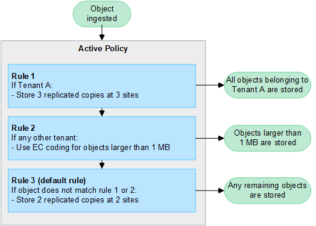

= Utilizzare i criteri ILM
:allow-uri-read: 
:icons: font
:imagesdir: ../media/

[role="lead"]
Un criterio ILM (Information Lifecycle Management) è un insieme ordinato di regole ILM che determina il modo in cui il sistema StorageGRID gestisce i dati degli oggetti nel tempo.

CAUTION: Un criterio ILM non configurato correttamente può causare una perdita di dati non ripristinabile. Prima di attivare un criterio ILM, esaminare attentamente il criterio ILM e le relative regole ILM, quindi simulare il criterio ILM. Verificare sempre che la policy ILM funzioni come previsto.

== Policy ILM predefinita

Quando si installa StorageGRID e si aggiungono siti, viene creato automaticamente un criterio ILM predefinito, come segue:

* Se la griglia contiene un sito, il criterio predefinito contiene una regola predefinita che replica due copie di ciascun oggetto in quel sito.
* Se la griglia contiene più siti, la regola predefinita replica una copia di ciascun oggetto in ciascun sito.

Se il criterio predefinito non soddisfa i requisiti di storage, è possibile creare regole e policy personalizzate. Vedere link:what-ilm-rule-is.html["Creare una regola ILM"] e link:creating-ilm-policy.html["Creare un criterio ILM"].

== Una o più policy ILM attive?

È possibile disporre di uno o più criteri ILM attivi alla volta.

=== Un'unica policy

Se il grid usa un semplice schema di data Protection con poche regole specifiche del tenant e del bucket, utilizza una singola policy ILM attiva. Le regole ILM possono contenere filtri per gestire bucket o tenant diversi.

image::../media/ilm-policies-single.png[Singolo diagramma delle policy ILM]

Quando si dispone di un solo criterio e i requisiti di un tenant cambiano, è necessario creare un nuovo criterio ILM o clonare il criterio esistente per applicare le modifiche, simulare e attivare quindi il nuovo criterio ILM. Le modifiche alla policy ILM possono comportare spostamenti degli oggetti che possono richiedere molti giorni e causare la latenza del sistema.

=== Policy multiple

Per offrire opzioni di qualità del servizio diverse ai tenant, è possibile disporre di più policy attive alla volta. Ogni policy può gestire tenant specifici, bucket S3 e oggetti. Quando si applicano o si modifica una policy per un insieme specifico di tenant o oggetti, le policy applicate agli altri tenant e oggetti non verranno influenzate.

Tag dei criteri ILM:: Se desideri consentire ai tenant di alternare facilmente tra più policy di data Protection in base al bucket, utilizza policy ILM multiple con _tag policy ILM_. Ogni policy ILM viene assegnata a un tag, quindi i tenant etichettano un bucket per applicare la policy a quel bucket. È possibile impostare tag di policy ILM solo su bucket S3.
+
--
Ad esempio, potresti avere tre tag denominati Gold, Silver e Bronze. È possibile assegnare un criterio ILM a ciascun tag in base alla durata e alla posizione in cui tale criterio memorizza gli oggetti. I tenant possono scegliere la policy da utilizzare contrassegnando i propri bucket. Un bucket con tag Gold viene gestito dalla policy Gold e riceve il livello Gold di data Protection e performance.

--
Tag criterio ILM predefinito:: Quando si installa StorageGRID, viene creato automaticamente un tag di criterio ILM predefinito. Ogni griglia deve avere un criterio attivo assegnato al tag predefinito. Il criterio predefinito si applica a tutti i bucket S3 non contrassegnati.

image::../media/ilm-policies-tags-conceptual.png[Diagramma di policy ILM multiple]

== In che modo un criterio ILM valuta gli oggetti?

Una policy ILM attiva controlla il posizionamento, la durata e la protezione dei dati degli oggetti.

Quando i client salvano gli oggetti in StorageGRID, gli oggetti vengono valutati in base all'insieme ordinato di regole ILM nel criterio, come segue:

. Se i filtri per la prima regola del criterio corrispondono a un oggetto, l'oggetto viene acquisito in base al comportamento di acquisizione di tale regola e memorizzato in base alle istruzioni di posizionamento di tale regola.
. Se i filtri per la prima regola non corrispondono all'oggetto, l'oggetto viene valutato in base a ogni regola successiva nel criterio fino a quando non viene effettuata una corrispondenza.
. Se nessuna regola corrisponde a un oggetto, vengono applicate le istruzioni di inserimento e posizionamento della regola predefinita nel criterio. La regola predefinita è l'ultima regola di un criterio. La regola predefinita deve essere applicata a tutti i tenant, a tutti i bucket S3 e a tutte le versioni degli oggetti e non può utilizzare alcun filtro avanzato.

== Esempio di policy ILM

Ad esempio, un criterio ILM potrebbe contenere tre regole ILM che specificano quanto segue:

* *Regola 1: Copie replicate per il tenant A*
+
** Abbina tutti gli oggetti appartenenti al tenant A.
** Memorizzare questi oggetti come tre copie replicate in tre siti.
** Gli oggetti appartenenti ad altri tenant non corrispondono alla regola 1, quindi vengono valutati in base alla regola 2.

* *Regola 2: Erasure coding per oggetti superiori a 1 MB*
+
** Associare tutti gli oggetti degli altri tenant, ma solo se sono superiori a 1 MB. Questi oggetti più grandi vengono memorizzati utilizzando la codifica di cancellazione 6+3 in tre siti.
** Non corrisponde a oggetti di dimensioni pari o inferiori a 1 MB, pertanto questi oggetti vengono valutati in base alla regola 3.

* *Regola 3: 2 copie 2 data center* (impostazione predefinita)
+
** È l'ultima regola predefinita del criterio. Non utilizza filtri.
** Creare due copie replicate di tutti gli oggetti non corrispondenti alla regola 1 o alla regola 2 (oggetti non appartenenti al tenant A di dimensioni pari o inferiori a 1 MB).

== Cosa sono i criteri attivi e inattivi?

Ogni sistema StorageGRID deve avere almeno una policy ILM attiva. Se si desidera disporre di più criteri ILM attivi, è necessario creare tag dei criteri ILM e assegnare un criterio a ciascun tag. I tenant applicano quindi i tag ai bucket S3. Il criterio predefinito viene applicato a tutti gli oggetti nei bucket che non hanno un tag di criterio assegnato.

Quando si crea per la prima volta un criterio ILM, selezionare una o più regole ILM e disporle in un ordine specifico. Dopo aver simulato il criterio per confermarne il comportamento, lo si attiva.

Quando si attiva un criterio ILM, StorageGRID utilizza tale criterio per gestire tutti gli oggetti, inclusi gli oggetti esistenti e gli oggetti appena acquisiti. Gli oggetti esistenti potrebbero essere spostati in nuove posizioni quando vengono implementate le regole ILM nel nuovo criterio.

Se si attivano più policy ILM alla volta e i tenant applicano tag ai bucket S3, gli oggetti in ogni bucket vengono gestiti in base alla policy assegnata al tag.

Un sistema StorageGRID tiene traccia della cronologia delle policy attivate o disattivate.

== Considerazioni per la creazione di un criterio ILM

* Utilizzare solo il criterio fornito dal sistema, il criterio di base 2 copie, nei sistemi di test. Per StorageGRID 11.6 e versioni precedenti, la regola Make 2 Copies in questo criterio utilizza il pool di storage All Storage Node, che contiene tutti i siti. Se il sistema StorageGRID dispone di più siti, è possibile che due copie di un oggetto vengano posizionate sullo stesso sito.
+

NOTE: Il pool di storage All Storage Node viene creato automaticamente durante l'installazione di StorageGRID 11.6 e versioni precedenti. Se si esegue l'aggiornamento a una versione successiva di StorageGRID, il pool di tutti i nodi di storage continuerà a esistere. Se si installa StorageGRID 11.7 o versione successiva come nuova installazione, il pool di tutti i nodi di storage non viene creato.

* Durante la progettazione di un nuovo criterio, considerare tutti i diversi tipi di oggetti che potrebbero essere inseriti nella griglia. Assicurarsi che il criterio includa regole per la corrispondenza e posizionare questi oggetti secondo necessità.
* Mantenere la policy ILM il più semplice possibile. In questo modo si evitano situazioni potenzialmente pericolose in cui i dati degli oggetti non sono protetti come previsto quando nel tempo vengono apportate modifiche al sistema StorageGRID.
* Assicurarsi che le regole della policy siano nell'ordine corretto. Una volta attivato il criterio, gli oggetti nuovi ed esistenti vengono valutati dalle regole nell'ordine elencato, iniziando dall'inizio. Ad esempio, se la prima regola di un criterio corrisponde a un oggetto, tale oggetto non verrà valutato da altre regole.
* L'ultima regola in ogni policy ILM è la regola ILM predefinita, che non può utilizzare alcun filtro. Se un oggetto non è stato associato da un'altra regola, la regola predefinita controlla la posizione e il tempo di conservazione dell'oggetto.
* Prima di attivare un nuovo criterio, esaminare le modifiche apportate dal criterio al posizionamento degli oggetti esistenti. La modifica della posizione di un oggetto esistente potrebbe causare problemi di risorse temporanee quando i nuovi posizionamenti vengono valutati e implementati.

