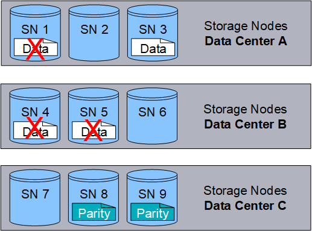

= Cos'è la codifica erasure?
:allow-uri-read: 
:icons: font
:imagesdir: ../media/

[role="lead"]
L'erasure coding è uno dei due metodi utilizzati da StorageGRID per memorizzare i dati degli oggetti (l'altro metodo è la replica). Quando gli oggetti corrispondono a una regola ILM che utilizza la codifica erasure, vengono suddivisi in frammenti di dati, vengono calcolati ulteriori frammenti di parità e ciascun frammento viene memorizzato in un nodo di storage diverso.

Quando si accede a un oggetto, questo viene riassemblato utilizzando i frammenti memorizzati. Se un dato o un frammento di parità viene corrotto o perso, l'algoritmo di erasure coding può ricreare quel frammento utilizzando un sottoinsieme dei dati rimanenti e dei frammenti di parità.

Quando crei regole ILM, StorageGRID crea profili di erasure coding in grado di supportarle. È possibile visualizzare un elenco di profili di erasure coding, link:manage-erasure-coding-profiles.html#rename-an-erasure-coding-profile["rinominare un profilo con erasure coding"], o link:manage-erasure-coding-profiles.html#deactivate-an-erasure-coding-profile["Disattivare un profilo di erasure coding se non è attualmente utilizzato in nessuna regola ILM"].

Nell'esempio seguente viene illustrato l'utilizzo di un algoritmo di erasure coding sui dati di un oggetto. In questo esempio, la regola ILM utilizza uno schema di erasure coding 4+2. Ciascun oggetto viene suddiviso in quattro frammenti di dati uguali e due frammenti di parità vengono calcolati dai dati dell'oggetto. Ciascuno dei sei frammenti viene memorizzato su un nodo diverso in tre siti del data center per fornire protezione dei dati in caso di guasti al nodo o perdita del sito.

image::../media/ec_three_sites_4_plus_2.png[Erasure coding Three Sites 4 Plus 2]

Lo schema di erasure coding 4+2 può essere configurato in vari modi. Ad esempio, è possibile configurare un pool di storage a sito singolo che contiene sei nodi di storage. Per link:using-multiple-storage-pools-for-cross-site-replication.html["protezione contro la perdita di sito"], è possibile utilizzare un pool di archiviazione contenente tre siti con tre nodi di archiviazione in ciascun sito. Un oggetto può essere recuperato finché quattro dei sei frammenti (dati o parità) rimangono disponibili. È possibile perdere fino a due frammenti senza perdita dei dati dell'oggetto. In caso di perdita di un intero sito, l'oggetto può comunque essere recuperato o riparato, purché tutti gli altri frammenti rimangano accessibili.

image::../media/ec_recoverable_4_plus_2.png[Erasure coding recoverable 4 Plus 2]

In caso di perdita di più di due nodi di storage, l'oggetto non può essere recuperato.

.Informazioni correlate
* link:what-replication-is.html["Cos'è la replica"]
* link:what-storage-pool-is.html["Che cos'è un pool di storage"]
* link:what-erasure-coding-schemes-are.html["Cosa sono gli schemi di erasure coding"]
* link:manage-erasure-coding-profiles.html#rename-an-erasure-coding-profile["Rinominare un profilo con erasure coding"]
* link:manage-erasure-coding-profiles.html#deactivate-an-erasure-coding-profile["Disattivare un profilo di erasure coding"]

