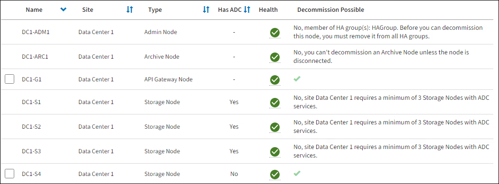

= Accedere alla pagina nodi di smantellamento
:allow-uri-read: 
:icons: font
:imagesdir: ../media/

[role="lead"]
Quando si accede alla pagina nodi di disattivazione in Grid Manager, è possibile visualizzare a colpo d'occhio i nodi che possono essere disattivati.

.Prima di iniziare
* L'utente ha effettuato l'accesso a Grid Manager utilizzando un link:../admin/web-browser-requirements.html["browser web supportato"].
* Si dispone di link:../admin/admin-group-permissions.html["Autorizzazione di manutenzione o di accesso root"].

CAUTION: Prestare attenzione quando si disattivano i nodi di storage in un grid che contiene nodi solo metadati basati su software. Se tutti i nodi configurati per l'archiviazione di _entrambi_ oggetti e metadati vengono dismessi, la possibilità di archiviare oggetti viene rimossa dalla griglia. Per ulteriori informazioni sui nodi di storage solo per metadati, vedere link:../primer/what-storage-node-is.html#types-of-storage-nodes["Tipi di nodi storage"].

.Fasi
. Selezionare *MANUTENZIONE* > *attività* > *Smantella*.
. Selezionare *nodi di decommissionazione*.
+
Viene visualizzata la pagina nodi di decommissionazione. Da questa pagina è possibile:

+
** Determinare quali nodi di rete possono essere attualmente dismessi.
** Scopri lo stato di salute di tutti i nodi della griglia
** Ordinare l'elenco in ordine crescente o decrescente per *Nome*, *Sito*, *tipo* o *con ADC*.
** Inserisci i termini di ricerca per trovare rapidamente nodi specifici.
+
In questo esempio, la colonna Decommission possible (Decommission possibile) indica che è possibile decommissionare il nodo gateway e uno dei quattro nodi di archiviazione.

+

. Esaminare la colonna *Dismissione possibile* per ciascun nodo che si desidera decommissionare.
+
Se è possibile disattivare un nodo della griglia, questa colonna include un segno di spunta verde e la colonna di sinistra contiene una casella di controllo. Se un nodo non può essere decommissionato, questa colonna descrive il problema. Se vi sono più motivi per cui un nodo non può essere dismesso, viene visualizzato il motivo più critico.

+
[cols="1a,1a,1a"]
|===
| Motivo possibile della decommissionazione | Descrizione | Procedura da seguire per risolvere il problema 

 a| 
No, la disattivazione _node type_ non è supportata.
 a| 
Impossibile decommissionare il nodo di amministrazione primario.
 a| 
Nessuno.

 a| 
No, almeno un nodo della griglia è scollegato.

*Nota:* questo messaggio viene visualizzato solo per i nodi di rete connessi.
 a| 
Non è possibile decommissionare un nodo di rete connesso se un nodo di rete è scollegato.

La colonna *Health* include una di queste icone per i nodi della griglia disconnessi:

** image:../media/icon_alarm_gray_administratively_down.png["icona del punto interrogativo grigio"] (Grigio): Amministrativamente giù
** image:../media/icon_alarm_blue_unknown.png["icona del punto interrogativo blu"] (Blu): Sconosciuto

 a| 
È necessario riportare tutti i nodi disconnessi in linea o link:decommissioning-disconnected-grid-nodes.html["decommissionare tutti i nodi disconnessi"] prima di rimuovere un nodo connesso.

*Nota*: Se la griglia contiene più nodi disconnessi, il software richiede di disattivarli tutti contemporaneamente, aumentando il rischio di risultati imprevisti.

 a| 
No, uno o più nodi richiesti sono attualmente disconnessi e devono essere ripristinati.

*Nota:* questo messaggio viene visualizzato solo per i nodi della griglia disconnessi.
 a| 
Non è possibile decommissionare un nodo di rete disconnesso se anche uno o più nodi richiesti sono disconnessi (ad esempio, un nodo di storage necessario per il quorum ADC).
 a| 
.. Esaminare i messaggi Decommission possible per tutti i nodi disconnessi.
.. Determinare quali nodi non possono essere dismessi perché sono necessari.
+
*** Se lo stato di salute di un nodo richiesto è amministrativamente inattivo, riportare il nodo in linea.
*** Se l'integrità di un nodo richiesto è sconosciuta, eseguire una procedura di ripristino del nodo per ripristinare il nodo richiesto.

 a| 
No, membro dei gruppi ha: _Nome gruppo_. Prima di poter decommissionare questo nodo, è necessario rimuoverlo da tutti i gruppi ha.
 a| 
Non è possibile decommissionare un nodo amministrativo o un nodo gateway se un'interfaccia di nodo appartiene a un gruppo ad alta disponibilità (ha).
 a| 
Modificare il gruppo ha per rimuovere l'interfaccia del nodo o rimuovere l'intero gruppo ha. Vedere link:../admin/configure-high-availability-group.html["Configurare i gruppi ad alta disponibilità"].

 a| 
No, il sito _x_ richiede un minimo di _n_ nodi di storage con servizi ADC.
 a| 
*Solo nodi di archiviazione.* Non è possibile decommissionare un nodo di storage se nel sito rimangono nodi insufficienti per supportare i requisiti quorum ADC.
 a| 
Eseguire un'espansione. Aggiungere un nuovo nodo di storage al sito e specificare che deve disporre di un servizio ADC. Vedere le informazioni su link:understanding-adc-service-quorum.html["Quorum ADC"].

 a| 
No, uno o più profili di erasure coding necessitano di almeno _n_ nodi di storage. Se il profilo non viene utilizzato in una regola ILM, è possibile disattivarlo.
 a| 
*Solo nodi di archiviazione.* Non è possibile decommissionare un nodo di storage a meno che non rimangano un numero sufficiente di nodi per i profili di erasure coding esistenti.

Ad esempio, se esiste un profilo di erasure coding per l'erasure coding 4+2, devono rimanere almeno 6 nodi storage.
 a| 
Per ogni profilo di erasure coding interessato, eseguire una delle seguenti operazioni, in base al modo in cui viene utilizzato il profilo:

** *Utilizzato nei criteri ILM attivi*: Eseguire un'espansione. Aggiungere un numero sufficiente di nuovi nodi di storage per consentire la cancellazione del codice. Vedere le istruzioni per link:../expand/index.html["espandere la tua griglia"].
** *Utilizzato in una regola ILM ma non nei criteri ILM attivi*: Modificare o eliminare la regola e quindi disattivare il profilo di erasure coding.
** *Non utilizzato in alcuna regola ILM*: Disattivare il profilo di erasure coding.

*Nota:* viene visualizzato un messaggio di errore se si tenta di disattivare un profilo di erasure coding e i dati dell'oggetto sono ancora associati al profilo. Potrebbe essere necessario attendere alcune settimane prima di provare di nuovo il processo di disattivazione.

Ulteriori informazioni su link:../ilm/manage-erasure-coding-profiles.html["disattivazione di un profilo di erasure coding"].

 a| 
No, non è possibile smantellare un nodo di archiviazione a meno che il nodo non sia disconnesso.
 a| 
Se un nodo archivio è ancora connesso, non è possibile rimuoverlo.
 a| 
*Nota*: Il supporto per i nodi di archiviazione è stato rimosso. Se è necessario smantellare un nodo di archivio, vedere https://docs.netapp.com/us-en/storagegrid-118/maintain/grid-node-decommissioning.html["Decommissionamento nodo griglia (sito doc StorageGRID 11,8)"^]

|===

