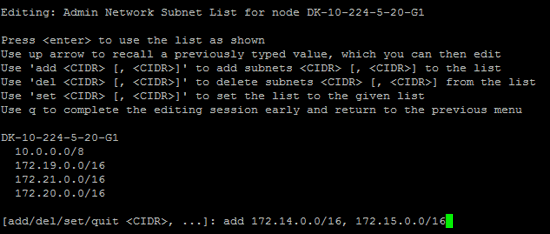

= Aggiungere o modificare gli elenchi di subnet nella rete amministrativa
:allow-uri-read: 
:icons: font
:imagesdir: ../media/

[role="lead"]
È possibile aggiungere, eliminare o modificare le subnet nell'elenco subnet di rete amministrativa di uno o più nodi.

.Prima di iniziare
* Si dispone del `Passwords.txt` file.

È possibile aggiungere, eliminare o modificare le subnet in tutti i nodi dell'elenco subnet di rete amministrativa.

.Fasi
. Accedere al nodo di amministrazione principale:
+
.. Immettere il seguente comando: `ssh admin@_primary_Admin_Node_IP_`
.. Immettere la password elencata nel `Passwords.txt` file.
.. Immettere il seguente comando per passare alla directory principale: `su -`
.. Immettere la password elencata nel `Passwords.txt` file.

+
Quando si è collegati come root, il prompt cambia da `$` a `#`.

. Avviare lo strumento Change IP inserendo il seguente comando: `change-ip`
. Inserire la passphrase di provisioning quando richiesto.
+
Viene visualizzato il menu principale.

+
image::../media/change_ip_tool_main_menu.png[Schermata di benvenuto dello strumento Change IP]

. Facoltativamente, limitare le reti/nodi su cui vengono eseguite le operazioni. Scegliere una delle seguenti opzioni:
+
** Selezionare i nodi da modificare scegliendo *1*, se si desidera filtrare su nodi specifici su cui eseguire l'operazione. Selezionare una delle seguenti opzioni:
+
*** *1*: Nodo singolo (selezionare per nome)
*** *2*: Nodo singolo (selezionare per sito, quindi per nome)
*** *3*: Nodo singolo (selezionato in base all'IP corrente)
*** *4*: Tutti i nodi di un sito
*** *5*: Tutti i nodi della griglia
*** *0*: Torna indietro

** Consenti a "tutto" di rimanere selezionato. Una volta effettuata la selezione, viene visualizzata la schermata del menu principale. Il campo Selected Nodes (nodi selezionati) riflette la nuova selezione e ora tutte le operazioni selezionate verranno eseguite solo su questo elemento.

. Nel menu principale, selezionare l'opzione per modificare le subnet per la rete amministrativa (opzione *3*).
. Scegliere una delle seguenti opzioni:
+
--
** Per aggiungere una subnet, immettere il seguente comando: `add CIDR`
** Per eliminare una subnet, immettere il comando: `del CIDR`
** Per impostare l'elenco delle subnet, immettere il seguente comando: `set CIDR`

--
+
--

NOTE: Per tutti i comandi, è possibile immettere più indirizzi utilizzando questo formato: `add CIDR, CIDR`

Esempio: `add 172.14.0.0/16, 172.15.0.0/16, 172.16.0.0/16`

TIP: È possibile ridurre la quantità di digitazione richiesta utilizzando la "freccia su" per richiamare i valori digitati in precedenza al prompt di immissione corrente, quindi modificarli se necessario.

L'esempio riportato di seguito mostra l'aggiunta di subnet all'elenco subnet di rete amministrativa:

--
. Una volta pronti, inserire *q* per tornare alla schermata del menu principale. Le modifiche vengono mantenute fino a quando non vengono cancellate o applicate.
+

NOTE: Se è stata selezionata una delle modalità di selezione dei nodi "all" nel passaggio 2, premere *Invio* (senza *q*) per passare al nodo successivo nell'elenco.

. Scegliere una delle seguenti opzioni:
+
** Selezionare l'opzione *5* per visualizzare le modifiche nell'output isolato in modo da visualizzare solo l'elemento modificato. Le modifiche sono evidenziate in verde (aggiunte) o in rosso (eliminazioni), come mostrato nell'esempio riportato di seguito:
+
image::../media/change_ip_tool_aesl_sample_output.png[schermata descritta dal testo circostante]

** Selezionare l'opzione *6* per visualizzare le modifiche nell'output che visualizza la configurazione completa. Le modifiche sono evidenziate in verde (aggiunte) o in rosso (eliminazioni). *Nota:* alcuni emulatori di terminali potrebbero mostrare aggiunte ed eliminazioni utilizzando la formattazione strikehrough.
+
Quando si tenta di modificare l'elenco delle subnet, viene visualizzato il seguente messaggio:

+
[listing]
----
CAUTION: The Admin Network subnet list on the node might contain /32 subnets derived from automatically applied routes that aren't persistent. Host routes (/32 subnets) are applied automatically if the IP addresses provided for external services such as NTP or DNS aren't reachable using default StorageGRID routing, but are reachable using a different interface and gateway. Making and applying changes to the subnet list will make all automatically applied subnets persistent. If you don't want that to happen, delete the unwanted subnets before applying changes. If you know that all /32 subnets in the list were added intentionally, you can ignore this caution.
----
+
Se non sono state assegnate in modo specifico le subnet NTP e DNS dei server a una rete, StorageGRID crea automaticamente un percorso host (/32) per la connessione. Se, ad esempio, si preferisce un percorso /16 o /24 per la connessione in uscita a un server DNS o NTP, eliminare il percorso /32 creato automaticamente e aggiungere i percorsi desiderati. Se non si elimina la route host creata automaticamente, questa verrà persistente dopo l'applicazione di eventuali modifiche all'elenco delle subnet.

+

NOTE: Sebbene sia possibile utilizzare questi percorsi host rilevati automaticamente, in generale è necessario configurare manualmente i percorsi DNS e NTP per garantire la connettività.

. Selezionare l'opzione *7* per convalidare tutte le modifiche in fasi.
+
Questa convalida garantisce il rispetto delle regole per le reti Grid, Admin e Client, ad esempio l'utilizzo di sottoreti sovrapposte.

. Se si desidera, selezionare l'opzione *8* per salvare tutte le modifiche in più fasi e tornare in seguito per continuare ad apportare le modifiche.
+
Questa opzione consente di uscire dallo strumento Change IP e di avviarlo di nuovo in un secondo momento, senza perdere alcuna modifica non applicata.

. Effettuare una delle seguenti operazioni:
+
** Selezionare l'opzione *9* se si desidera annullare tutte le modifiche senza salvare o applicare la nuova configurazione di rete.
** Selezionare l'opzione *10* se si desidera applicare le modifiche e fornire la nuova configurazione di rete. Durante il provisioning, l'output visualizza lo stato quando vengono applicati gli aggiornamenti, come mostrato nell'output di esempio seguente:
+
[listing]
----
Generating new grid networking description file...

Running provisioning...

Updating grid network configuration on Name
----

. Scarica un nuovo pacchetto di ripristino da Grid Manager.
+
.. Selezionare *MANUTENZIONE* > *sistema* > *pacchetto di ripristino*.
.. Inserire la passphrase di provisioning.

