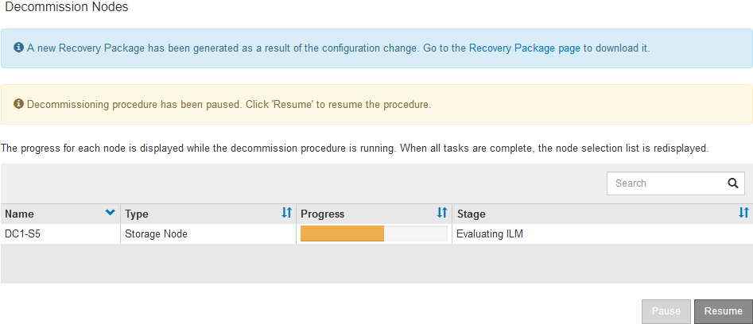

= Mettere in pausa e riprendere il processo di decommissionamento per i nodi di storage
:allow-uri-read: 
:icons: font
:imagesdir: ../media/

[role="lead"]
Se è necessario eseguire una seconda procedura di manutenzione, è possibile sospendere la procedura di decommissionamento per un nodo di storage durante determinate fasi. Al termine dell'altra procedura, è possibile riprendere la decommissionamento.

NOTE: Il pulsante *Pause* (Pausa) viene attivato solo quando vengono raggiunte le fasi di decommissionamento dei dati con codifica di cancellazione o valutazione ILM; tuttavia, la valutazione ILM (migrazione dei dati) continuerà a essere eseguita in background.

.Prima di iniziare
* L'utente ha effettuato l'accesso a Grid Manager utilizzando un link:../admin/web-browser-requirements.html["browser web supportato"].
* Si dispone di link:../admin/admin-group-permissions.html["Autorizzazione di manutenzione o di accesso root"].

.Fasi
. Selezionare *Manutenzione* > *Attività* > *Disattivazione*.
+
Viene visualizzata la pagina Decommission.

. Selezionare *nodi di decommissionazione*.
+
Viene visualizzata la pagina nodi di decommissionazione. Quando la procedura di decommissionamento raggiunge una delle seguenti fasi, il pulsante *Pause* (Pausa) viene attivato.

+
** Valutazione di ILM
** Decommissionamento dei dati codificati a cancellazione

. Selezionare *Pausa* per sospendere la procedura.
+
La fase corrente viene messa in pausa e il pulsante *Riprendi* viene attivato.

+

. Al termine dell'altra procedura di manutenzione, selezionare *Riprendi* per procedere con la decommissionazione.

