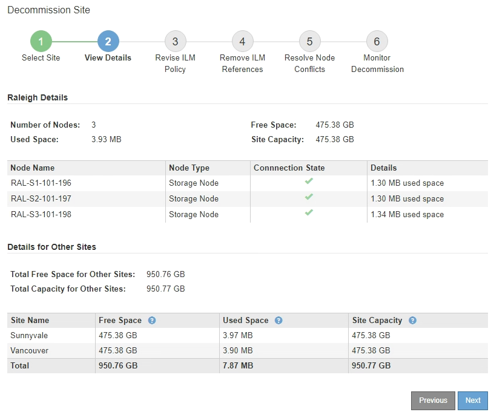

= Fase 2: Visualizzare i dettagli
:allow-uri-read: 
:icons: font
:imagesdir: ../media/

[role="lead"]
Dalla fase 2 (Visualizza dettagli) della procedura guidata Decommission Site, è possibile esaminare i nodi inclusi nel sito, verificare la quantità di spazio utilizzata su ciascun nodo di storage e valutare la quantità di spazio libero disponibile negli altri siti della griglia.

.Prima di iniziare
Prima di decommissionare un sito, è necessario esaminare la quantità di dati oggetto presenti nel sito.

* Se si sta eseguendo una decommissionazione del sito connesso, è necessario comprendere la quantità di dati oggetto attualmente presenti nel sito prima di aggiornare ILM. In base alle capacità del sito e alle esigenze di protezione dei dati, è possibile creare nuove regole ILM per spostare i dati in altri siti o per eliminare i dati degli oggetti dal sito.
* Eseguire le espansioni dei nodi di storage necessarie prima di avviare la procedura di decommissionamento, se possibile.
* Se si esegue una decommissionazione disconnessa del sito, è necessario comprendere la quantità di dati oggetto che diventeranno inaccessibili in modo permanente quando si rimuove il sito.

CAUTION: Se si sta eseguendo una decommissionazione disconnessa del sito, ILM non può spostare o eliminare i dati dell'oggetto. Tutti i dati che rimangono nel sito andranno persi. Tuttavia, se la policy ILM è stata progettata per proteggere dalla perdita di un singolo sito, le copie dei dati dell'oggetto rimangono nei siti rimanenti. Vedere link:../ilm/using-multiple-storage-pools-for-cross-site-replication.html["Abilita la protezione contro la perdita di sito"].

.Fasi
. Dal passaggio 2 (Visualizza dettagli), esaminare eventuali avvisi relativi al sito selezionato per la rimozione.
+
image::../media/decommission_site_step_2_site_warnings.png[Decommissionare il sito fase 2 Avvertenze sul sito]

+
Viene visualizzato un avviso nei seguenti casi:

+
** Il sito include un nodo gateway. Se i client S3 si stanno attualmente collegando a questo nodo, è necessario configurare un nodo equivalente in un altro sito. Assicurarsi che i client possano connettersi al nodo sostitutivo prima di continuare con la procedura di decommissionamento.
** Il sito contiene una combinazione di nodi collegati (image:../media/icon_alert_green_checkmark.png["Icona Avviso segno di spunta verde"]) e disconnessi (image:../media/icon_alarm_gray_administratively_down.png["Icona Alarm Grey amministrativamente in basso"] o image:../media/icon_alarm_blue_unknown.png["Icona allarme blu sconosciuto"]). Prima di poter rimuovere questo sito, è necessario riportare tutti i nodi offline in linea.

. Esaminare i dettagli del sito selezionato per la rimozione.
+

+
Per il sito selezionato sono incluse le seguenti informazioni:

+
** Numero di nodi
** Lo spazio utilizzato totale, lo spazio libero e la capacità di tutti i nodi di storage nel sito.
+
*** Per la decommissionazione di un sito connesso, il valore *Used Space* rappresenta la quantità di dati oggetto che devono essere spostati in altri siti o cancellati con ILM.
*** Per la decommissionazione di un sito disconnesso, il valore *spazio utilizzato* indica la quantità di dati oggetto che diventeranno inaccessibili quando si rimuove il sito.

** Nomi, tipi e stati di connessione dei nodi:
+
*** image:../media/icon_alert_green_checkmark.png["Icona Avviso segno di spunta verde"] (Collegato)
*** image:../media/icon_alarm_gray_administratively_down.png["Icona Alarm Grey amministrativamente in basso"] (Amministrazione abbassata)
*** image:../media/icon_alarm_blue_unknown.png["Icona allarme blu sconosciuto"] (Sconosciuto)

** Dettagli su ciascun nodo:
+
*** Per ciascun nodo di storage, la quantità di spazio utilizzata per i dati dell'oggetto.
*** Per i nodi Admin e Gateway, se il nodo è attualmente utilizzato in un gruppo ad alta disponibilità (ha). Non è possibile decommissionare un nodo Admin o un nodo Gateway utilizzato in un gruppo ha. Prima di iniziare la decommissionazione, modificare i gruppi ha per rimuovere tutti i nodi nel sito o rimuovere il gruppo ha se include solo i nodi da questo sito. Per istruzioni, vedere link:../admin/managing-high-availability-groups.html["Gestire i gruppi ad alta disponibilità (ha)"].

. Nella sezione Dettagli per altri siti della pagina, valuta lo spazio disponibile negli altri siti della griglia.
+
image::../media/decommission_site_step_2_view_details_for_other_sites.png[Decommissionare il sito fase 2 visualizzare i dettagli per altri siti]

+
Se si sta eseguendo una decommissionazione del sito connesso e si prevede di utilizzare ILM per spostare i dati dell'oggetto dal sito selezionato (invece di eliminarli semplicemente), è necessario assicurarsi che gli altri siti abbiano una capacità sufficiente per ospitare i dati spostati e che rimanga una capacità adeguata per la crescita futura.

+

NOTE: Viene visualizzato un avviso se lo spazio utilizzato * del sito che si desidera rimuovere è maggiore di *spazio libero totale per altri siti*. Per garantire che sia disponibile una capacità di storage adeguata dopo la rimozione del sito, potrebbe essere necessario eseguire un'espansione prima di eseguire questa procedura.

. Selezionare *Avanti*.
+
Viene visualizzato il punto 3 (revisione policy ILM).

