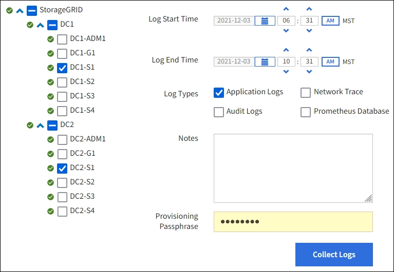

= Raccogliere i file di log e i dati di sistema
:allow-uri-read: 
:icons: font
:imagesdir: ../media/

[role="lead"]
È possibile utilizzare Grid Manager per recuperare i file di log e i dati di sistema (inclusi i dati di configurazione) per il sistema StorageGRID.

.Prima di iniziare
* È necessario aver effettuato l'accesso al Grid Manager sul nodo amministrativo primario utilizzando un link:../admin/web-browser-requirements.html["browser web supportato"].
* Si dispone di link:../admin/admin-group-permissions.html["autorizzazioni di accesso specifiche"].
* È necessario disporre della passphrase di provisioning.

.A proposito di questa attività
È possibile utilizzare Grid Manager per raccogliere link:logs-files-reference.html["file di log"], dati di sistema e dati di configurazione da qualsiasi nodo della griglia per il periodo di tempo selezionato. I dati vengono raccolti e archiviati in un file .tar.gz che è possibile scaricare sul computer locale.

In alternativa, è possibile modificare la destinazione dei registri di controllo e inviare le informazioni di controllo a un server syslog esterno. I registri locali dei record di controllo continuano a essere generati e memorizzati quando viene configurato un server syslog esterno. Vedere link:../monitor/configure-audit-messages.html["Configurare i messaggi di audit e le destinazioni dei log"].

.Fasi
. Selezionare *SUPPORT* > *Tools* > *Logs*.
+

. Selezionare i nodi della griglia per i quali si desidera raccogliere i file di log.
+
Se necessario, è possibile raccogliere i file di log per l'intera griglia o per un intero sito del data center.

. Selezionare *ora di inizio* e *ora di fine* per impostare l'intervallo di tempo dei dati da includere nei file di log.
+
Se si seleziona un periodo di tempo molto lungo o si raccolgono i registri da tutti i nodi di una griglia di grandi dimensioni, l'archivio del registro potrebbe diventare troppo grande per essere memorizzato su un nodo o troppo grande per essere raccolto nel nodo di amministrazione primario per il download. In questo caso, è necessario riavviare la raccolta dei log con un set di dati più piccolo.

. Selezionare i tipi di log che si desidera raccogliere.
+
** *Registri delle applicazioni*: Registri specifici delle applicazioni che il supporto tecnico utilizza più frequentemente per la risoluzione dei problemi. I log raccolti sono un sottoinsieme dei log dell'applicazione disponibili.
** *Audit Logs*: Registri contenenti i messaggi di audit generati durante il normale funzionamento del sistema.
** *Network Trace*: Registri utilizzati per il debug della rete.
** *Database Prometheus*: Metriche delle serie temporali dei servizi su tutti i nodi.

. Se si desidera, inserire le note relative ai file di registro che si stanno raccogliendo nella casella di testo *Notes*.
+
È possibile utilizzare queste note per fornire informazioni di supporto tecnico sul problema che ha richiesto di raccogliere i file di log. Le note vengono aggiunte a un file denominato `info.txt`, insieme ad altre informazioni sulla raccolta di file di registro. Il `info.txt` file viene salvato nel pacchetto di archiviazione del file di registro.

. Inserire la passphrase di provisioning per il sistema StorageGRID nella casella di testo *Passphrase di provisioning*.
. Selezionare *Collect Logs* (raccolta registri).
+
Quando si invia una nuova richiesta, la raccolta precedente di file di log viene eliminata.

+
È possibile utilizzare la pagina Logs per monitorare l'avanzamento della raccolta dei file di log per ciascun nodo della griglia.

+
Se viene visualizzato un messaggio di errore relativo alle dimensioni del registro, provare a raccogliere i registri per un periodo di tempo più breve o per un numero inferiore di nodi.

. Selezionare *Download* al termine della raccolta dei file di log.
+
Il file _.tar.gz_ contiene tutti i file di log di tutti i nodi della griglia in cui la raccolta dei log ha avuto esito positivo. All'interno del file _.tar.gz_ combinato, è presente un archivio di file di log per ciascun nodo della griglia.

.Al termine
Se necessario, è possibile scaricare nuovamente il pacchetto di archiviazione del file di log in un secondo momento.

In alternativa, è possibile selezionare *Delete* (Elimina) per rimuovere il pacchetto di archiviazione del file di log e liberare spazio su disco. Il pacchetto di archiviazione del file di log corrente viene automaticamente rimosso alla successiva raccolta dei file di log.
