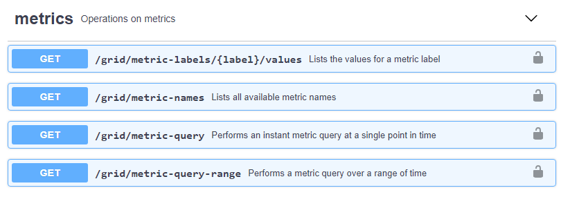

= Creare applicazioni di monitoraggio personalizzate
:allow-uri-read: 
:icons: font
:imagesdir: ../media/

[role="lead"]
Puoi creare dashboard e applicazioni di monitoraggio personalizzate utilizzando le metriche StorageGRID disponibili nell'API di gestione del grid.

Se si desidera monitorare le metriche non visualizzate in una pagina esistente di Grid Manager o se si desidera creare dashboard personalizzati per StorageGRID, è possibile utilizzare l'API di gestione griglia per eseguire query sulle metriche StorageGRID.

Puoi anche accedere direttamente alle metriche Prometheus con uno strumento di monitoraggio esterno, come Grafana. L'utilizzo di uno strumento esterno richiede il caricamento o la generazione di un certificato client amministrativo per consentire a StorageGRID di autenticare lo strumento per la sicurezza. Consultare la link:../admin/index.html["Istruzioni per l'amministrazione di StorageGRID"].

Per visualizzare le operazioni API delle metriche, incluso l'elenco completo delle metriche disponibili, accedere a Grid Manager. Nella parte superiore della pagina, selezionare l'icona della guida e selezionare *documentazione API* > *metriche*. 

I dettagli su come implementare un'applicazione di monitoraggio personalizzata esulano dall'ambito di questa documentazione.
