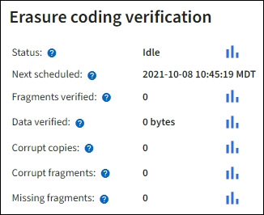

= Monitorare le operazioni di verifica degli oggetti
:allow-uri-read: 
:icons: font
:imagesdir: ../media/

[role="lead"]
Il sistema StorageGRID è in grado di verificare l'integrità dei dati degli oggetti sui nodi di storage, verificando la presenza di oggetti danneggiati e mancanti.

.Prima di iniziare
* L'utente ha effettuato l'accesso a Grid Manager utilizzando un link:../admin/web-browser-requirements.html["browser web supportato"].
* Si dispone di link:../admin/admin-group-permissions.html["Autorizzazione di manutenzione o di accesso root"].

.A proposito di questa attività
Due link:../troubleshoot/verifying-object-integrity.html["processi di verifica"] lavorano insieme per garantire l'integrità dei dati:

* *La verifica in background* viene eseguita automaticamente, controllando continuamente la correttezza dei dati dell'oggetto.
+
La verifica in background verifica automaticamente e continuamente tutti i nodi di storage per determinare se sono presenti copie corrotte dei dati degli oggetti replicati e codificati in cancellazione. In caso di problemi, il sistema StorageGRID tenta automaticamente di sostituire i dati dell'oggetto corrotto da copie memorizzate in un'altra parte del sistema. La verifica in background non viene eseguita sugli oggetti in un Cloud Storage Pool.

+

NOTE: L'avviso *rilevato oggetto corrotto non identificato* viene attivato se il sistema rileva un oggetto corrotto che non può essere corretto automaticamente.

* *Il controllo dell'esistenza di oggetti* può essere attivato da un utente per verificare più rapidamente l'esistenza (anche se non la correttezza) dei dati dell'oggetto.
+
Il controllo dell'esistenza degli oggetti verifica se tutte le copie replicate previste degli oggetti e i frammenti con codifica di cancellazione sono presenti in un nodo di storage. Il controllo dell'esistenza degli oggetti consente di verificare l'integrità dei dispositivi di storage, in particolare se un recente problema hardware potrebbe aver influenzato l'integrità dei dati.

È necessario esaminare regolarmente i risultati delle verifiche in background e dei controlli sull'esistenza degli oggetti. Esaminare immediatamente eventuali istanze di dati degli oggetti corrotti o mancanti per determinare la causa principale.

.Fasi
. Esaminare i risultati delle verifiche in background:
+
.. Selezionare *Nodi* > *Nodo di archiviazione_* > *Oggetti*.
.. Verificare i risultati della verifica:
+
*** Per controllare la verifica dei dati degli oggetti replicati, esaminare gli attributi nella sezione verifica.
+
image::../media/nodes_storage_node_object_verification.png[Nodi > nodo di storage > oggetto > verifica]

*** Per controllare la verifica dei frammenti con codifica di cancellazione, selezionare *_Storage Node_* > *ILM* e controllare gli attributi nella sezione Erasure coding verifcation.
+

+
Selezionare il punto interrogativo image:../media/icon_nms_question.png["punto interrogativo"]accanto al nome di un attributo per visualizzare il testo della guida.

. Esaminare i risultati dei job di controllo dell'esistenza di oggetti:
+
.. Selezionare *Manutenzione* > *Controllo esistenza oggetto* > *Cronologia lavori*.
.. Esaminare la colonna Copie di oggetti mancanti rilevate.  Se un processo ha causato la perdita di 100 o più copie di oggetti ed è stato attivato l'avviso *Oggetti potenzialmente persi*, contattare l'assistenza tecnica.
+
image::../media/oec_job_history.png[Cronologia del processo di controllo dell'esistenza di oggetti]

