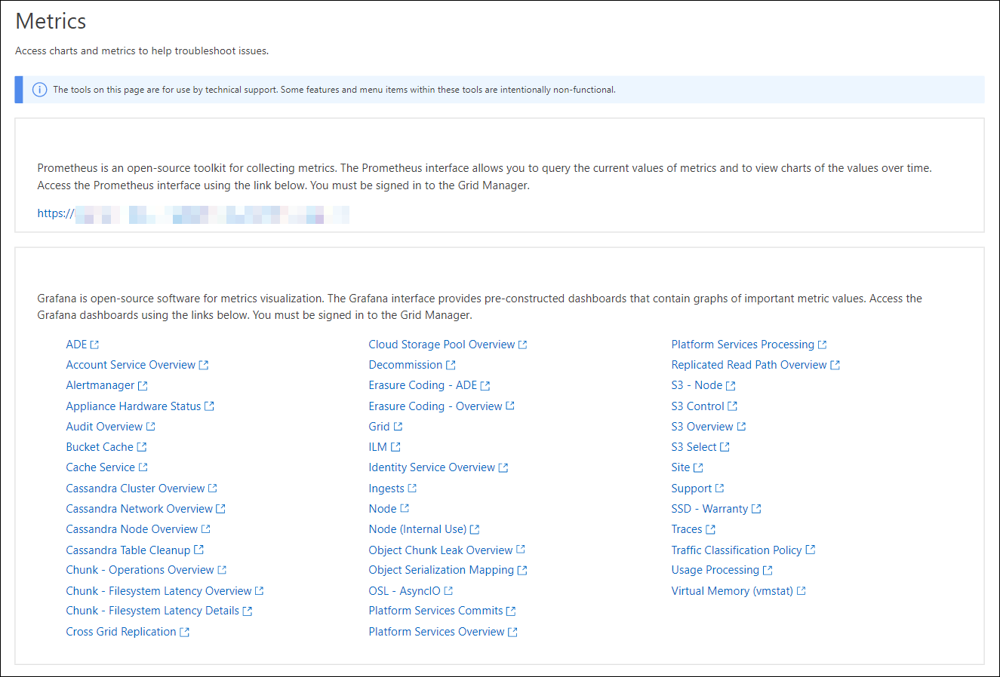

= Rivedere le metriche di supporto
:allow-uri-read: 
:icons: font
:imagesdir: ../media/

[role="lead"]
Durante la risoluzione di un problema, puoi lavorare con il supporto tecnico per rivedere metriche e grafici dettagliati per il tuo sistema StorageGRID.

.Prima di iniziare
* È necessario accedere a Grid Manager utilizzando un link:../admin/web-browser-requirements.html["browser web supportato"].
* Si dispone di link:../admin/admin-group-permissions.html["autorizzazioni di accesso specifiche"].

.A proposito di questa attività
La pagina metriche consente di accedere alle interfacce utente Prometheus e Grafana. Prometheus è un software open-source per la raccolta di metriche. Grafana è un software open-source per la visualizzazione delle metriche.

NOTE: Gli strumenti disponibili nella pagina metriche sono destinati all'utilizzo da parte del supporto tecnico. Alcune funzioni e voci di menu di questi strumenti sono intenzionalmente non funzionali e sono soggette a modifiche. Vedere l'elenco di link:commonly-used-prometheus-metrics.html["Metriche Prometheus comunemente utilizzate"].

.Fasi
. Come indicato dal supporto tecnico, selezionare *SUPPORTO* > *Strumenti* > *metriche*.
+
Di seguito è riportato un esempio della pagina Metrics (metriche):

+

. Per interrogare i valori correnti delle metriche StorageGRID e visualizzare i grafici dei valori nel tempo, fare clic sul collegamento nella sezione Prometheus.
+
Viene visualizzata l'interfaccia Prometheus. È possibile utilizzare questa interfaccia per eseguire query sulle metriche StorageGRID disponibili e per rappresentare graficamente le metriche StorageGRID nel tempo.

+

NOTE: Le metriche che includono _private_ nei loro nomi sono destinate esclusivamente all'uso interno e sono soggette a modifiche tra le release di StorageGRID senza preavviso.

. Per accedere alle dashboard predefinite contenenti grafici delle metriche StorageGRID nel tempo, fare clic sui collegamenti nella sezione Grafana.
+
Viene visualizzata l'interfaccia Grafana per il collegamento selezionato.

+
image::../media/metrics_page_grafana.png[Pagina delle metriche Grafana]

