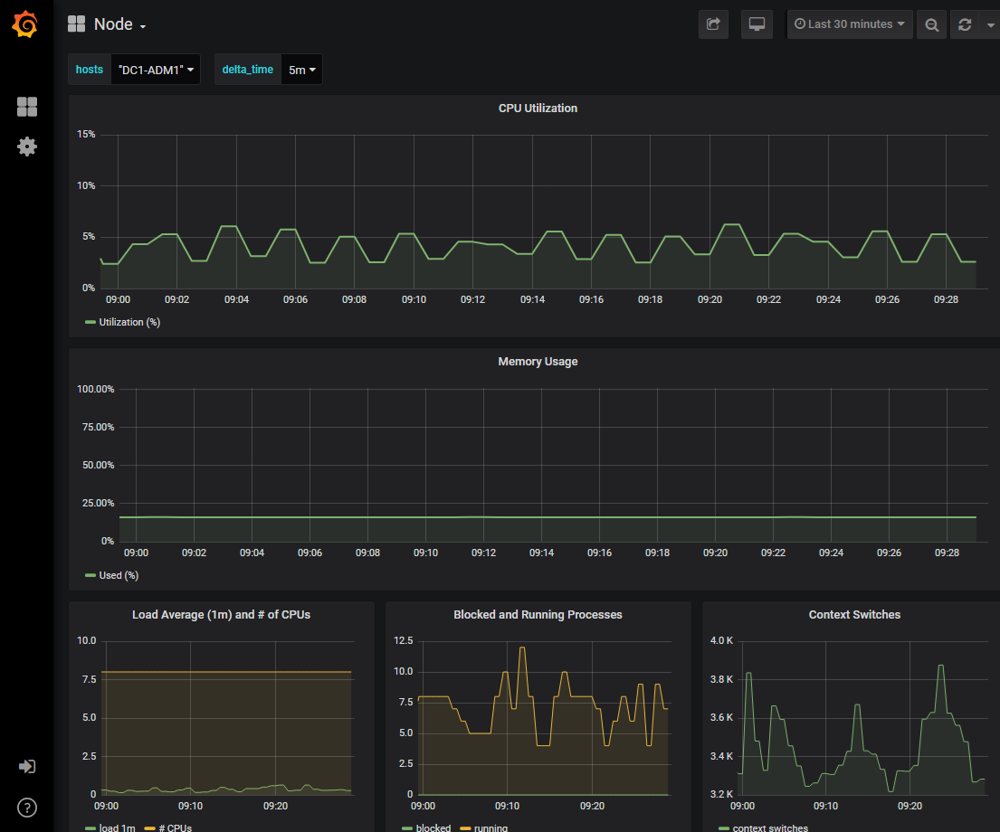

= Eseguire la diagnostica
:allow-uri-read: 
:icons: font
:imagesdir: ../media/

[role="lead"]
Durante la risoluzione di un problema, è possibile collaborare con il supporto tecnico per eseguire la diagnostica sul sistema StorageGRID e rivedere i risultati.

* link:reviewing-support-metrics.html["Rivedere le metriche di supporto"]
* link:commonly-used-prometheus-metrics.html["Metriche Prometheus comunemente utilizzate"]

.Prima di iniziare
* L'utente ha effettuato l'accesso a Grid Manager utilizzando un link:../admin/web-browser-requirements.html["browser web supportato"].
* Si dispone di link:../admin/admin-group-permissions.html["autorizzazioni di accesso specifiche"].

.A proposito di questa attività
La pagina Diagnostics (Diagnostica) esegue una serie di controlli diagnostici sullo stato corrente della griglia. Ogni controllo diagnostico può avere uno dei tre stati seguenti:

* image:../media/icon_alert_green_checkmark.png["Icona Avviso segno di spunta verde"] *Normale*: Tutti i valori rientrano nell'intervallo normale.
* image:../media/icon_alert_yellow_minor.png["Icona Avviso giallo minore"] *Attenzione*: Uno o più valori non rientrano nell'intervallo normale.
* image:../media/icon_alert_red_critical.png["Icona Avviso rosso critico"] *Attenzione*: Uno o più valori sono significativamente al di fuori del range normale.

Gli stati di diagnostica sono indipendenti dagli avvisi correnti e potrebbero non indicare problemi operativi con la griglia. Ad esempio, un controllo diagnostico potrebbe mostrare lo stato di attenzione anche se non è stato attivato alcun allarme.

.Fasi
. Selezionare *Supporto* > *Strumenti* > *Diagnostica*.
+
Viene visualizzata la pagina Diagnostics (Diagnostica) che elenca i risultati di ciascun controllo diagnostico. I risultati vengono ordinati in base alla gravità (attenzione, attenzione e quindi normale). All'interno di ciascuna severità, i risultati sono ordinati in ordine alfabetico.

+
In questo esempio, una diagnosi ha lo stato Attenzione e tre diagnosi hanno lo stato Normale.

+
image::../media/support_diagnostics_page.png[Pagina Support Diagnostics (Diagnostica di supporto)]

. Per ulteriori informazioni su una diagnostica specifica, fare clic in un punto qualsiasi della riga.
+
Vengono visualizzati i dettagli relativi alla diagnostica e ai risultati correnti. Sono elencati i seguenti dettagli:

+
** *Status* (Stato): Lo stato corrente di questa diagnostica: Normal (normale), Attention (attenzione) o Caution (attenzione).
** *Query Prometheus*: Se utilizzata per la diagnostica, l'espressione Prometheus utilizzata per generare i valori di stato. (Un'espressione Prometheus non viene utilizzata per tutte le diagnostiche).
** *Soglie*: Se disponibili per la diagnostica, le soglie definite dal sistema per ogni stato di diagnostica anomalo. (I valori di soglia non vengono utilizzati per tutte le diagnostiche).
+

NOTE: Non puoi modificare queste soglie.

** *Valori di stato*: un grafico e una tabella (la tabella non è mostrata nello screenshot) che mostrano lo stato e il valore della diagnostica nell'intero sistema StorageGRID .  In questo esempio viene mostrato l'utilizzo attuale della CPU per ogni nodo in un sistema StorageGRID .  Tutti i valori dei nodi sono al di sotto delle soglie di Attenzione e Attenzione, quindi lo stato generale della diagnosi è Normale.
+
image::../media/support_diagnostics_cpu_utilization.png[Esempio di valori di stato della diagnostica]

. *Facoltativo*: per visualizzare i grafici Grafana correlati a questa diagnostica, seleziona *Dashboard Grafana*.
+
Questo collegamento non viene visualizzato per tutte le diagnostiche.

+
Viene visualizzata la dashboard Grafana correlata.  In questo esempio, viene visualizzata la dashboard del nodo che mostra l'utilizzo della CPU nel tempo per questo nodo, nonché altri grafici Grafana per il nodo.

+

NOTE: È anche possibile accedere alle dashboard Grafana predefinite dalla sezione Grafana della pagina *Supporto* > *Strumenti* > *Metriche*.

+

. *Opzionale*: Per visualizzare un grafico dell'espressione Prometheus nel tempo, fare clic su *Visualizza in Prometheus*.
+
Viene visualizzato un grafico Prometheus dell'espressione utilizzata nella diagnostica.

+
image::../media/support_diagnostics_prometheus_png.png[Pagina Support Diagnostics Prometheus (Prometheus diagnostica di supporto)]

