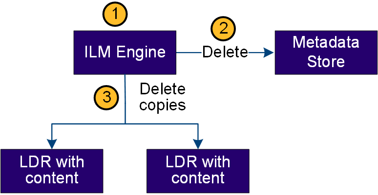

= Eliminare il flusso di dati
:allow-uri-read: 
:icons: font
:imagesdir: ../media/

[role="lead"]
Tutte le copie degli oggetti vengono rimosse dal sistema StorageGRID quando un client esegue un'operazione di eliminazione o quando scade la durata dell'oggetto, attivandone la rimozione automatica. Esiste un flusso di dati definito per l'eliminazione degli oggetti.

== Gerarchia di eliminazione

StorageGRID offre diversi metodi per controllare quando gli oggetti vengono conservati o cancellati. Gli oggetti possono essere cancellati automaticamente o su richiesta del client. StorageGRID assegna sempre la priorità a qualsiasi impostazione di blocco oggetti S3 rispetto alle richieste di eliminazione del client, che hanno la priorità sul ciclo di vita del bucket S3 e sulle istruzioni di posizionamento ILM.

* *S3 Object Lock*: Se l'impostazione globale S3 Object Lock è attivata per la griglia, i client S3 possono creare bucket con S3 Object Lock abilitato e quindi utilizzare l'API REST S3 per specificare le impostazioni di conservazione fino alla data e conservazione legale per ogni versione di oggetto aggiunta a quel bucket.
+
** Una versione dell'oggetto soggetta a blocco legale non può essere eliminata da alcun metodo.
** Prima che venga raggiunta la data di conservazione di una versione a oggetti, tale versione non può essere eliminata da alcun metodo.
** Gli oggetti nei bucket con blocco oggetti S3 abilitato vengono conservati da ILM "per sempre". Tuttavia, una volta raggiunta la data di conservazione, una versione dell'oggetto può essere eliminata da una richiesta del client o dalla scadenza del ciclo di vita del bucket.
** Se i client S3 applicano al bucket una data di conservazione predefinita, non devono specificare una data di conservazione per ciascun oggetto.

* *Client delete request*: Un client S3 può emettere una richiesta di eliminazione degli oggetti. Quando un client elimina un oggetto, tutte le copie dell'oggetto vengono rimosse dal sistema StorageGRID.
* *Elimina oggetti nel bucket*: Gli utenti di tenant Manager possono utilizzare questa opzione per rimuovere in modo permanente tutte le copie degli oggetti e delle versioni degli oggetti nei bucket selezionati dal sistema StorageGRID.
* *Ciclo di vita del bucket S3*: I client S3 possono aggiungere una configurazione del ciclo di vita ai bucket che specifica un'azione di scadenza. Se esiste un ciclo di vita del bucket, StorageGRID elimina automaticamente tutte le copie di un oggetto quando viene soddisfatta la data o il numero di giorni specificati nell'azione di scadenza, a meno che il client non elimini prima l'oggetto.
* *Istruzioni di posizionamento ILM*: Supponendo che il bucket non abbia attivato il blocco oggetti S3 e che non vi sia alcun ciclo di vita del bucket, StorageGRID elimina automaticamente un oggetto al termine dell'ultimo periodo di tempo della regola ILM e non vi sono ulteriori posizionamenti specificati per l'oggetto.
+

NOTE: Quando viene configurato un ciclo di vita del bucket S3, le azioni di scadenza del ciclo di vita sovrascrivono il criterio ILM per gli oggetti che corrispondono al filtro del ciclo di vita. Di conseguenza, un oggetto potrebbe essere conservato sulla griglia anche dopo che sono scadute le istruzioni ILM per il posizionamento dell'oggetto.

Per ulteriori informazioni, vedere link:../ilm/how-objects-are-deleted.html["Modalità di eliminazione degli oggetti"] .

== Eliminazione del flusso di dati per il client

image::../media/delete_data_flow.png[Flusso di dati di eliminazione del client]

. Il servizio LDR riceve una richiesta di eliminazione dall'applicazione client.
. Il servizio LDR aggiorna l'archivio di metadati in modo che l'oggetto venga cancellato dalle richieste del client e istruisce il motore ILM a rimuovere tutte le copie dei dati dell'oggetto.
. L'oggetto viene rimosso dal sistema. L'archivio di metadati viene aggiornato per rimuovere i metadati degli oggetti.

== Flusso di dati per l'eliminazione di ILM

. Il motore ILM determina che l'oggetto deve essere cancellato.
. Il motore ILM invia una notifica all'archivio di metadati. L'archivio di metadati aggiorna i metadati degli oggetti in modo che l'oggetto venga cancellato dalle richieste del client.
. Il motore ILM rimuove tutte le copie dell'oggetto. L'archivio di metadati viene aggiornato per rimuovere i metadati degli oggetti.

