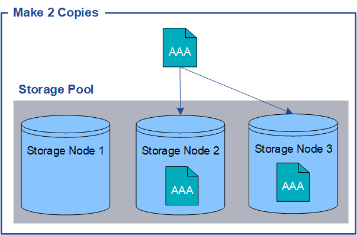

= Che cos'è un oggetto
:allow-uri-read: 
:icons: font
:imagesdir: ../media/

[role="lead"]
Con lo storage a oggetti, l'unità di storage è un oggetto, piuttosto che un file o un blocco. A differenza della gerarchia ad albero di un file system o di uno storage a blocchi, lo storage a oggetti organizza i dati in un layout piatto e non strutturato.

Lo storage a oggetti separa la posizione fisica dei dati dal metodo utilizzato per memorizzare e recuperare tali dati.

Ogni oggetto in un sistema di storage basato su oggetti ha due parti: Dati oggetto e metadati oggetto.

image::../media/object_conceptual_drawing.png[Oggetto]

== Che cos'è un dato a oggetti?

I dati degli oggetti possono essere qualsiasi cosa, ad esempio una fotografia, un filmato o un documento medico.

== Che cos'è il metadata a oggetti?

I metadati degli oggetti sono informazioni che descrivono un oggetto. StorageGRID utilizza i metadati degli oggetti per tenere traccia delle posizioni di tutti gli oggetti nella griglia e gestire il ciclo di vita di ciascun oggetto nel tempo.

I metadati dell'oggetto includono informazioni come:

* Metadati di sistema, tra cui un ID univoco per ciascun oggetto (UUID), il nome dell'oggetto, il nome del bucket S3 o del container Swift, il nome o l'ID dell'account tenant, la dimensione logica dell'oggetto, la data e l'ora in cui l'oggetto è stato creato per la prima volta, e la data e l'ora dell'ultima modifica dell'oggetto.
* La posizione di storage corrente di ogni copia di oggetto o frammento con codifica di cancellazione.
* Qualsiasi metadati utente associato all'oggetto.

I metadati degli oggetti sono personalizzabili ed espandibili, il che lo rende flessibile per l'utilizzo da parte delle applicazioni.

Per informazioni dettagliate su come e dove StorageGRID archivia i metadati degli oggetti, visitare il sito link:../admin/managing-object-metadata-storage.html["Gestire lo storage dei metadati degli oggetti"].

== Come vengono protetti i dati a oggetti?

Il sistema StorageGRID offre due meccanismi per proteggere i dati degli oggetti dalla perdita: Replica e erasure coding.

=== Replica

Quando StorageGRID abbina gli oggetti a una regola di Information Lifecycle management (ILM) configurata per creare copie replicate, il sistema crea copie esatte dei dati degli oggetti e li memorizza sui nodi storage o sui pool di cloud storage. Le regole ILM determinano il numero di copie effettuate, la posizione in cui vengono memorizzate e la durata della conservazione da parte del sistema. Se una copia viene persa, ad esempio, a causa della perdita di un nodo di storage, l'oggetto rimane disponibile se una copia di esso esiste altrove nel sistema StorageGRID.

Nell'esempio seguente, la regola Make 2 copies specifica che due copie replicate di ciascun oggetto devono essere collocate in un pool di storage che contiene tre nodi di storage.

=== Erasure coding

Quando StorageGRID associa oggetti a una regola ILM configurata per creare copie con codifica di cancellazione, slice i dati degli oggetti in frammenti di dati, calcola ulteriori frammenti di parità e memorizza ogni frammento su un nodo di storage diverso. Quando si accede a un oggetto, questo viene riassemblato utilizzando i frammenti memorizzati. Se un dato o un frammento di parità viene corrotto o perso, l'algoritmo di erasure coding può ricreare quel frammento utilizzando un sottoinsieme dei rimanenti dati e frammenti di parità. Le regole ILM e i profili di erasure coding determinano lo schema di erasure coding utilizzato.

Nell'esempio riportato di seguito viene illustrato l'utilizzo della codifica erasure sui dati di un oggetto. In questo esempio, la regola ILM utilizza uno schema di erasure coding 4+2. Ciascun oggetto viene suddiviso in quattro frammenti di dati uguali e due frammenti di parità vengono calcolati dai dati dell'oggetto. Ciascuno dei sei frammenti viene memorizzato su un nodo di storage diverso in tre data center per fornire protezione dei dati in caso di guasti al nodo o perdita del sito.

image::../media/ec_three_sites_4_plus_2.png[Erasure Coded Three Sites 4 Plus 2]

.Informazioni correlate
* link:../ilm/index.html["Gestire gli oggetti con ILM"]
* link:using-information-lifecycle-management.html["Utilizza la gestione del ciclo di vita delle informazioni"]

