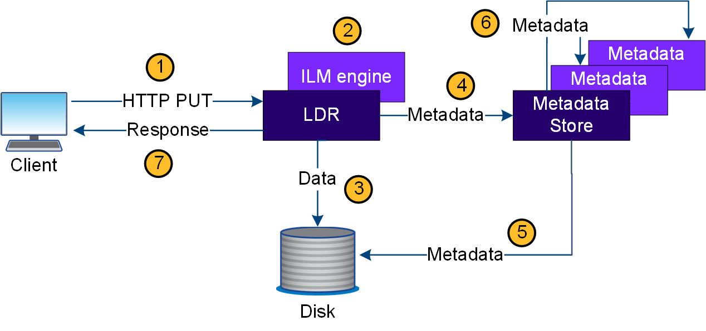

= Acquisire il flusso di dati
:allow-uri-read: 
:icons: font
:imagesdir: ../media/

[role="lead"]
Un'operazione di acquisizione, o salvataggio, consiste in un flusso di dati definito tra il client e il sistema StorageGRID.

== Flusso di dati

Quando un client acquisisce un oggetto nel sistema StorageGRID, il servizio LDR sui nodi di storage elabora la richiesta e memorizza i metadati e i dati su disco.

. L'applicazione client crea l'oggetto e lo invia al sistema StorageGRID tramite una richiesta HTTP PUT.
. L'oggetto viene valutato in base al criterio ILM del sistema.
. Il servizio LDR salva i dati dell'oggetto come copia replicata o come copia sottoposta a erasure coding. (Il diagramma mostra una versione semplificata della memorizzazione di una copia replicata su disco).
. Il servizio LDR invia i metadati dell'oggetto all'archivio di metadati.
. L'archivio di metadati salva i metadati dell'oggetto su disco.
. L'archivio di metadati propaga le copie dei metadati degli oggetti ad altri nodi di storage. Queste copie vengono salvate anche su disco.
. Il servizio LDR restituisce una risposta HTTP 200 OK al client per confermare che l'oggetto è stato acquisito.

