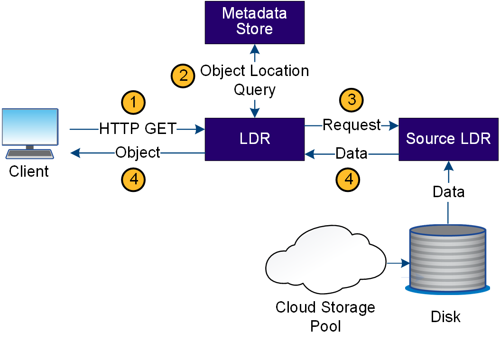

= Recuperare il flusso di dati
:allow-uri-read: 
:icons: font
:imagesdir: ../media/

[role="lead"]
Un'operazione di recupero consiste in un flusso di dati definito tra il sistema StorageGRID e il client. Il sistema utilizza gli attributi per tenere traccia del recupero dell'oggetto da un nodo di storage o, se necessario, da un pool di cloud storage.

Il servizio LDR di Storage Node interroga l'archivio di metadati per la posizione dei dati dell'oggetto e li recupera dal servizio LDR di origine. Preferenzialmente, il recupero avviene da un nodo di storage. Se l'oggetto non è disponibile su un nodo di archiviazione, la richiesta di recupero viene indirizzata a un pool di archiviazione cloud.

NOTE: Se l'unica copia dell'oggetto si trova sullo storage AWS Glacier o nel Tier Azure Archive, l'applicazione client deve emettere una richiesta S3 RestoreObject per ripristinare una copia recuperabile in Cloud Storage Pool.

. Il servizio LDR riceve una richiesta di recupero dall'applicazione client.
. Il servizio LDR interroga l'archivio di metadati per la posizione dei dati dell'oggetto e i metadati.
. Il servizio LDR inoltra la richiesta di recupero al servizio LDR di origine.
. Il servizio LDR di origine restituisce i dati dell'oggetto dal servizio LDR interrogato e il sistema restituisce l'oggetto all'applicazione client.

