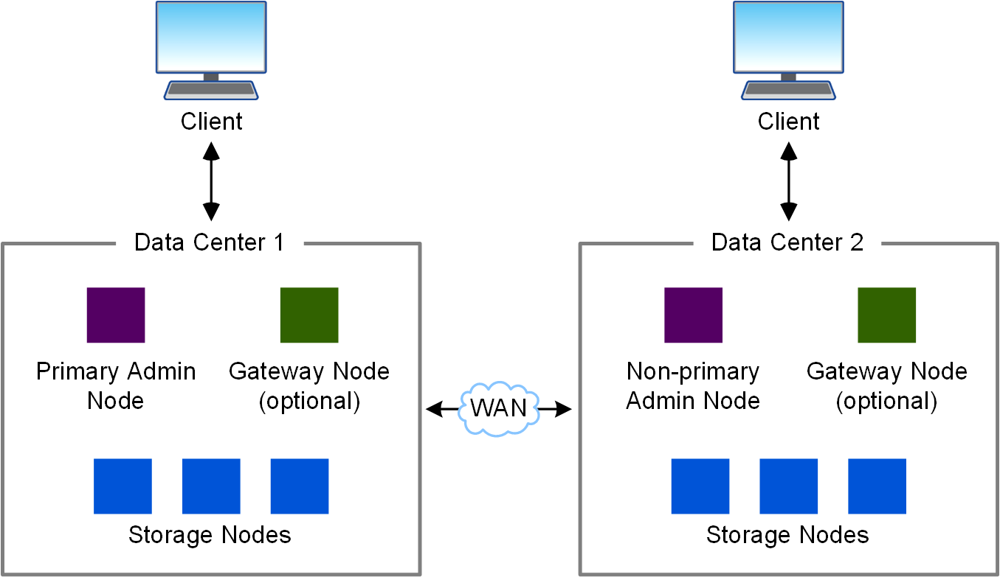

= Architettura StorageGRID e topologia di rete
:allow-uri-read: 
:icons: font
:imagesdir: ../media/

[role="lead"]
Un sistema StorageGRID è costituito da più tipi di nodi grid in uno o più siti del data center.

Scopri di più sulink:nodes-and-services.html["tipi di nodi della griglia"] .

Per ulteriori informazioni sulla topologia di rete StorageGRID , sui requisiti e sulle comunicazioni di rete, fare riferimento alink:../network/index.html["Linee guida per il networking"] .

== Topologie di implementazione

Il sistema StorageGRID può essere distribuito in un singolo sito di data center o in più siti di data center.  Il numero massimo di siti per distribuzione è 16.

=== Sito singolo

In un'implementazione con un singolo sito, l'infrastruttura e le operazioni del sistema StorageGRID sono centralizzate.

image::../media/data_center_site_single.png[Singolo sito del data center]

=== Più siti

In un'implementazione con più siti, è possibile installare diversi tipi e numeri di risorse StorageGRID in ogni sito. Ad esempio, potrebbe essere necessario più storage in un data center che in un altro.

Spesso i siti sono ubicati in posizioni geografiche diverse, in domini di guasto diversi, come una faglia sismica o una pianura alluvionale.  La condivisione dei dati e il ripristino in caso di disastro vengono ottenuti mediante la distribuzione automatizzata dei dati ad altri siti.

All'interno di un singolo data center possono esistere anche più siti logici per consentire l'uso della replica distribuita e della codifica di cancellazione per una maggiore disponibilità e resilienza.

=== Ridondanza del nodo di rete

In un'implementazione a sito singolo o multi-sito, è possibile includere facoltativamente più di un nodo di amministrazione o un nodo gateway per la ridondanza. Ad esempio, è possibile installare più di un nodo di amministrazione in un singolo sito o in diversi siti. Tuttavia, ogni sistema StorageGRID può disporre di un solo nodo amministratore primario.

== Architettura di sistema

Questo diagramma mostra come i nodi della griglia sono disposti all'interno di un sistema StorageGRID.

image::../media/grid_nodes_and_components.png[diagramma descritto dal testo circostante]

I client S3 memorizzano e recuperano oggetti in StorageGRID. Altri client vengono utilizzati per inviare notifiche e-mail, per accedere all'interfaccia di gestione di StorageGRID e, facoltativamente, per accedere alla condivisione dell'audit.

I client S3 possono connettersi a un nodo gateway o a un nodo amministrativo per utilizzare l'interfaccia di bilanciamento del carico per i nodi di storage. In alternativa, i client S3 possono connettersi direttamente ai nodi storage utilizzando HTTPS.

Gli oggetti possono essere archiviati in StorageGRID su nodi di archiviazione basati su software o hardware oppure in pool di archiviazione cloud, costituiti da bucket S3 esterni o contenitori di archiviazione BLOB di Azure.
