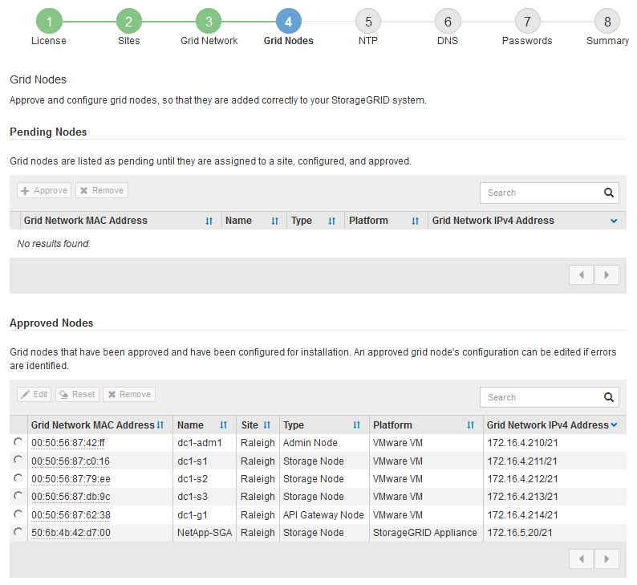

= Approvare i nodi griglia in sospeso
:allow-uri-read: 
:icons: font
:imagesdir: ../media/

[role="lead"]
È necessario approvare ciascun nodo della griglia prima che possa unirsi al sistema StorageGRID.

.Prima di iniziare
Hai implementato tutti i nodi grid delle appliance virtuali e StorageGRID.

NOTE: È più efficiente eseguire una singola installazione di tutti i nodi, piuttosto che installare alcuni nodi ora e alcuni nodi successivamente.

.Fasi
. Esaminare l'elenco Pending Nodes (nodi in sospeso) e confermare che mostra tutti i nodi della griglia implementati.
+

NOTE: Se manca un nodo griglia, verificare che sia stato distribuito correttamente e che l'IP della rete griglia del nodo amministrativo primario sia impostato per ADMIN_IP.

. Selezionare il pulsante di opzione accanto al nodo in sospeso che si desidera approvare.
+
image::../media/5_gmi_installer_grid_nodes_pending.gif[Questa immagine viene spiegata dal testo circostante.]

. Fare clic su *approva*.
. In General Settings (Impostazioni generali), modificare le impostazioni per le seguenti proprietà, in base alle necessità:
+
** *Sito*: Il nome di sistema del sito per questo nodo della griglia.
** *Name*: Il nome del sistema per il nodo. Il nome predefinito corrisponde al nome specificato al momento della configurazione del nodo.
+
I nomi di sistema sono necessari per le operazioni StorageGRID interne e non possono essere modificati dopo aver completato l'installazione. Tuttavia, durante questa fase del processo di installazione, è possibile modificare i nomi di sistema in base alle esigenze.

+
*** *Ruolo NTP*: Ruolo NTP (Network Time Protocol) del nodo Grid. Le opzioni disponibili sono *automatico*, *primario* e *Client*. Selezionando *automatico*, il ruolo primario viene assegnato ai nodi di amministrazione, ai nodi di storage con servizi ADC, ai nodi gateway e a tutti i nodi di griglia che hanno indirizzi IP non statici. A tutti gli altri nodi della griglia viene assegnato il ruolo Client.
+

CAUTION: Assicurarsi che almeno due nodi di ciascun sito possano accedere ad almeno quattro origini NTP esterne. Se solo un nodo di un sito può raggiungere le origini NTP, si verificheranno problemi di tempistica se tale nodo non funziona. Inoltre, la designazione di due nodi per sito come origini NTP primarie garantisce tempi precisi se un sito viene isolato dal resto della rete.

*** *Tipo di archiviazione* (solo nodi di archiviazione): Specificare che un nuovo nodo di archiviazione deve essere utilizzato esclusivamente per i dati, solo metadati o entrambi. Le opzioni sono *dati e metadati* ("combinati"), *solo dati* e *solo metadati*.
+

CAUTION: Vedere link:../primer/what-storage-node-is.html#types-of-storage-nodes["Tipi di nodi storage"] per informazioni sui requisiti di questi tipi di nodi.

*** *Servizio ADC* (solo nodi di storage): Selezionare *automatico* per consentire al sistema di determinare se il nodo richiede il servizio ADC (Administrative Domain Controller). Il servizio ADC tiene traccia della posizione e della disponibilità dei servizi grid. Almeno tre nodi di storage in ogni sito devono includere il servizio ADC. Non è possibile aggiungere il servizio ADC a un nodo dopo averlo implementato.

. In Grid Network, modificare le impostazioni per le seguenti proprietà secondo necessità:
+
** *IPv4 Address (CIDR)*: L'indirizzo di rete CIDR per l'interfaccia Grid Network (eth0 all'interno del container). Ad esempio: 192.168.1.234/21
** *Gateway*: Il gateway Grid Network. Ad esempio: 192.168.0.1
+
Il gateway è necessario se sono presenti più subnet di rete.

+

NOTE: Se si seleziona DHCP per la configurazione Grid Network e si modifica il valore, il nuovo valore verrà configurato come indirizzo statico sul nodo. È necessario assicurarsi che l'indirizzo IP configurato non si trovi all'interno di un pool di indirizzi DHCP.

. Se si desidera configurare la rete amministrativa per il nodo della griglia, aggiungere o aggiornare le impostazioni nella sezione rete amministrativa secondo necessità.
+
Inserire le subnet di destinazione dei percorsi fuori da questa interfaccia nella casella di testo *subnet (CIDR)*. Se sono presenti più subnet Admin, è necessario il gateway Admin.

+

NOTE: Se si seleziona DHCP per la configurazione Admin Network e si modifica il valore, il nuovo valore verrà configurato come indirizzo statico sul nodo. È necessario assicurarsi che l'indirizzo IP configurato non si trovi all'interno di un pool di indirizzi DHCP.

+
*Appliance:* per un'appliance StorageGRID, se la rete amministrativa non è stata configurata durante l'installazione iniziale utilizzando il programma di installazione dell'appliance StorageGRID, non è possibile configurarla in questa finestra di dialogo. È invece necessario attenersi alla seguente procedura:

+
.. Riavviare l'appliance: Nel programma di installazione dell'appliance, selezionare *Avanzate* > *Riavvia*.
+
Il riavvio può richiedere alcuni minuti.

.. Selezionare *Configure Networking* > *link Configuration* (Configura rete) e abilitare le reti appropriate.
.. Selezionare *Configura rete* > *Configurazione IP* e configurare le reti abilitate.
.. Tornare alla Home page e fare clic su *Avvia installazione*.
.. In Grid Manager: Se il nodo è elencato nella tabella Approved Nodes (nodi approvati), rimuoverlo.
.. Rimuovere il nodo dalla tabella Pending Nodes (nodi in sospeso).
.. Attendere che il nodo riappaia nell'elenco Pending Nodes (nodi in sospeso).
.. Confermare che è possibile configurare le reti appropriate. Devono essere già popolate con le informazioni fornite nella pagina di configurazione IP del programma di installazione dell'appliance.
+
Per ulteriori informazioni, consultare le istruzioni di installazione relative al modello di appliance in uso.

. Se si desidera configurare la rete client per il nodo Grid, aggiungere o aggiornare le impostazioni nella sezione rete client secondo necessità. Se la rete client è configurata, il gateway è necessario e diventa il gateway predefinito per il nodo dopo l'installazione.
+

NOTE: Se si seleziona DHCP per la configurazione di rete client e si modifica il valore, il nuovo valore verrà configurato come indirizzo statico sul nodo. È necessario assicurarsi che l'indirizzo IP configurato non si trovi all'interno di un pool di indirizzi DHCP.

+
*Appliance:* per un'appliance StorageGRID, se la rete client non è stata configurata durante l'installazione iniziale utilizzando il programma di installazione dell'appliance StorageGRID, non è possibile configurarla in questa finestra di dialogo. È invece necessario attenersi alla seguente procedura:

+
.. Riavviare l'appliance: Nel programma di installazione dell'appliance, selezionare *Avanzate* > *Riavvia*.
+
Il riavvio può richiedere alcuni minuti.

.. Selezionare *Configure Networking* > *link Configuration* (Configura rete) e abilitare le reti appropriate.
.. Selezionare *Configura rete* > *Configurazione IP* e configurare le reti abilitate.
.. Tornare alla Home page e fare clic su *Avvia installazione*.
.. In Grid Manager: Se il nodo è elencato nella tabella Approved Nodes (nodi approvati), rimuoverlo.
.. Rimuovere il nodo dalla tabella Pending Nodes (nodi in sospeso).
.. Attendere che il nodo riappaia nell'elenco Pending Nodes (nodi in sospeso).
.. Confermare che è possibile configurare le reti appropriate. Devono essere già popolate con le informazioni fornite nella pagina di configurazione IP del programma di installazione dell'appliance.
+
Per ulteriori informazioni, consultare le istruzioni di installazione dell'apparecchio.

. Fare clic su *Save* (Salva).
+
La voce del nodo della griglia viene spostata nell'elenco dei nodi approvati.

+

. Ripetere questi passaggi per ogni nodo griglia in sospeso che si desidera approvare.
+
È necessario approvare tutti i nodi desiderati nella griglia. Tuttavia, è possibile tornare a questa pagina in qualsiasi momento prima di fare clic su *Installa* nella pagina Riepilogo. È possibile modificare le proprietà di un nodo della griglia approvato selezionando il relativo pulsante di opzione e facendo clic su *Modifica*.

. Una volta completata l'approvazione dei nodi griglia, fare clic su *Avanti*.

