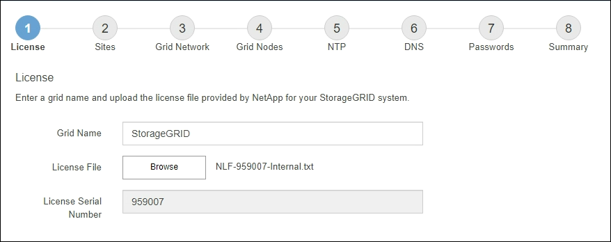

= Specificare le informazioni sulla licenza StorageGRID
:allow-uri-read: 
:icons: font
:imagesdir: ../media/

[role="lead"]
Specificare il nome del sistema StorageGRID e caricare il file di licenza fornito da NetApp.

.Fasi
. Nella pagina licenza, immettere un nome significativo per il sistema StorageGRID nel campo *Nome griglia*.
+
Dopo l'installazione, il nome viene visualizzato nella parte superiore del menu Nodes (nodi).

. Selezionare *Sfoglia*, individuare il file di licenza NetApp (`NLF-_unique-id_.txt`), quindi selezionare *Apri*.
+
Il file di licenza viene validato e viene visualizzato il numero di serie.

+

NOTE: L'archivio di installazione di StorageGRID include una licenza gratuita che non fornisce alcun diritto di supporto per il prodotto. È possibile eseguire l'aggiornamento a una licenza che offra supporto dopo l'installazione.

+

. Selezionare *Avanti*.

