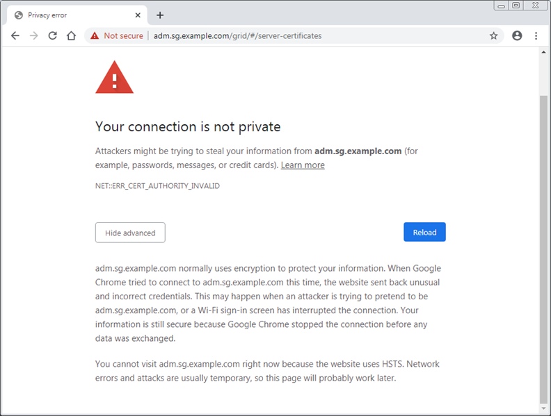

= Risolvere gli errori del certificato
:allow-uri-read: 
:icons: font
:imagesdir: ../media/

[role="lead"]
Se si verifica un problema di sicurezza o certificato quando si tenta di connettersi a StorageGRID utilizzando un browser Web, un client S3 o uno strumento di monitoraggio esterno, è necessario controllare il certificato.

.A proposito di questa attività
Gli errori dei certificati possono causare problemi quando si tenta di connettersi a StorageGRID utilizzando Gestione griglia, API di gestione griglia, Gestore tenant o API di gestione tenant. Gli errori dei certificati possono verificarsi anche quando si tenta di connettersi a un client S3 o a uno strumento di monitoraggio esterno.

Se si accede a Grid Manager o Tenant Manager utilizzando un nome di dominio invece di un indirizzo IP, il browser mostra un errore di certificato senza l'opzione di ignorare se si verifica una delle seguenti condizioni:

* Il certificato dell'interfaccia di gestione personalizzata scade.
* Viene ripristinato da un certificato dell'interfaccia di gestione personalizzata al certificato del server predefinito.

L'esempio seguente mostra un errore di certificato quando il certificato dell'interfaccia di gestione personalizzata è scaduto:

Per garantire che le operazioni non vengano interrotte da un certificato del server guasto, l'avviso *scadenza del certificato del server per l'interfaccia di gestione* viene attivato quando il certificato del server sta per scadere.

Quando si utilizzano certificati client per l'integrazione esterna di Prometheus, gli errori dei certificati possono essere causati dal certificato dell'interfaccia di gestione di StorageGRID o dai certificati client. L'avviso *scadenza dei certificati client configurati nella pagina certificati* viene attivato quando un certificato client sta per scadere.

.Fasi
Se si riceve una notifica di avviso relativa a un certificato scaduto, accedere ai dettagli del certificato: . Selezionare *CONFIGURAZIONE* > *sicurezza* > *certificati* e quindi link:../admin/using-storagegrid-security-certificates.html#access-security-certificates["selezionare la scheda del certificato appropriata"].

. Controllare il periodo di validità del certificato. + alcuni browser web e client S3 non accettano certificati con un periodo di validità superiore a 398 giorni.
. Se il certificato è scaduto o scadrà a breve, caricare o generare un nuovo certificato.
+
** Per un certificato server, vedere la procedura per link:../admin/configuring-custom-server-certificate-for-grid-manager-tenant-manager.html#add-a-custom-management-interface-certificate["Configurazione di un certificato server personalizzato per Grid Manager e Tenant Manager"].
** Per un certificato client, vedere la procedura per link:../admin/configuring-administrator-client-certificates.html["configurazione di un certificato client"].

. In caso di errori del certificato del server, provare una o entrambe le seguenti opzioni:
+
** Assicurarsi che il campo Subject alternative Name (SAN) del certificato sia compilato e che LA SAN corrisponda all'indirizzo IP o al nome host del nodo a cui si sta effettuando la connessione.
** Se si sta tentando di connettersi a StorageGRID utilizzando un nome di dominio:
+
... Inserire l'indirizzo IP del nodo di amministrazione invece del nome di dominio per evitare l'errore di connessione e accedere a Grid Manager.
... Da Grid Manager, selezionare *CONFIGURAZIONE* > *sicurezza* > *certificati*, quindi link:../admin/using-storagegrid-security-certificates.html#access-security-certificates["selezionare la scheda del certificato appropriata"] per installare un nuovo certificato personalizzato o continuare con il certificato predefinito.
... Nelle istruzioni per l'amministrazione di StorageGRID, vedere la procedura per link:../admin/configuring-custom-server-certificate-for-grid-manager-tenant-manager.html#add-a-custom-management-interface-certificate["Configurazione di un certificato server personalizzato per Grid Manager e Tenant Manager"].

